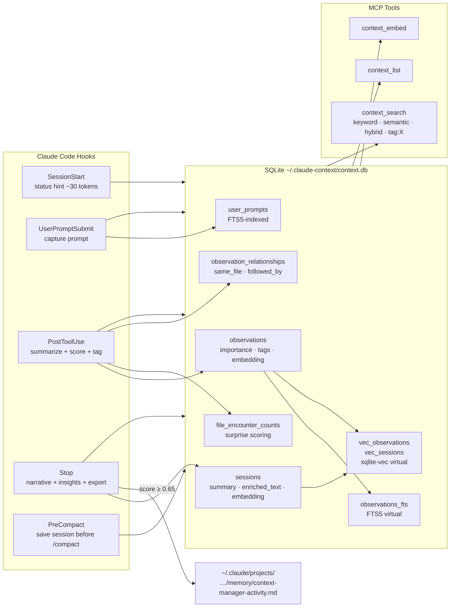

# CLAUDE.md

This file provides guidance to Claude Code when working in this repository.

**Status**: ACTIVE
**Last Updated**: May 30, 2026 (v0.8.134)

---

## Project Overview

**claude-context-manager** is a Claude Code plugin that provides structured session history and searchable context. It automatically captures tool interactions in SQLite with full-text search, and exports high-importance observations to Claude Code's auto-memory topic files.

**Owner**: Larry Smith Jr. | **Email**: mrlesmithjr@gmail.com
**Repository**: `github.com/mrlesmithjr/claude-context-manager`

---

## Branch Strategy

**Two branches. All development happens on `develop`. `main` is release-only.**

| Branch | Purpose | Direct push |
|--------|---------|-------------|
| `develop` | Active development, all commits land here | Yes |
| `main` | Stable releases only | NEVER — PRs only |

**Rules enforced at three layers:**

1. **GitHub ruleset** (`protect-main`, ID 16896369) — blocks any direct push to `main`, requires the `test` status check to pass before merge. No bypass, including for the repo owner.
2. **Local pre-push hook** (`scripts/pre-push-hook.sh`) — installed automatically by `npm install` via the `prepare` script. Aborts `git push` immediately if the destination ref is `main`.
3. **This document** — if you find yourself about to commit to `main`, stop. Push to `develop` and open a PR.

**Release workflow (develop to main):**
```bash
make release
```

`make release` opens the PR, polls CI until the `test` check passes, squash-merges, and pushes the tag. After it completes, run `/plugin update context-manager` inside Claude Code.

---

## Development Workflow

This is a TypeScript Claude Code plugin. All code changes follow the mandatory multi-agent sequence:

**Feature or fix:** `claude-code-plugin-developer → code-reviewer → doc-writer → make ship`

**Documentation only:** `doc-writer → commit (no version bump)`

**Agent responsibilities:**
- `claude-code-plugin-developer` - implement changes in `src/`, `plugin/hooks/`, `web/`, `cli/`
- `code-reviewer` - quality and security review before any commit (mandatory, never skip)
- `doc-writer` - update this CLAUDE.md, README.md, and any affected skill/agent descriptions

**Plugin release workflow** (after code review and doc-writer pass):
1. `make ship` - bumps patch version, builds, commits, pushes develop, restarts server, opens PR, waits for CI, merges to main, tags
2. `/plugin update context-manager` inside Claude Code
3. Restart Claude Code

**Mid-development iteration** (no release yet):
- `make update` - build + push develop + restart server, without bumping version or merging to main
- Use this when iterating and not ready to release

**Note:** `/plugin update` refreshes the Claude Code side (hooks + proxy) but does NOT restart the HTTP server. `make ship` and `make update` both restart the server automatically.

**Issue tracking:**
- Every code change must reference a GitHub issue in the commit (`fixes #N` or `refs #N`)
- Check open issues first: `gh issue list --repo mrlesmithjr/claude-context-manager --state open`

---

## Quick Reference

```bash
# Build
npm run build           # All components (src, hooks, CLI, web)
npm run build:plugin    # Build + prepare for plugin install
npm run typecheck       # Type check only
npm run clean           # Clean build artifacts

# CLI
npm run cli -- stats
npm run cli -- list --limit 10
npm run cli -- search "query"
npm run cli -- export --dry-run

# Web dashboard
npm run web             # http://localhost:3847
npm run web:dev         # Live reload
# Import tab: upload ~/.claude-context/context.db to migrate to Docker

# E2E tests
make test-e2e           # Build, run all scenarios, tear down (CI-safe)

# Remote server — macOS (launchd, persists across reboots)
make server-quickstart  # Init token + install launchd + start

# Remote server — Linux (Docker)
make server-init && make server-start

# Import historical transcripts
npm run import -- --source <path> --project <target> [--filter <text>] [--dry-run]
```

**MCP Tools:**
`context_add`, `context_stats`, `context_list`, `context_search`, `context_semantic_search`, `context_embed`,
`context_vacuum`, `context_export`, `context_memory_audit`, `context_memory_consolidate`, `context_pin`, `context_prune`,
`context_get`, `context_timeline`, `context_lessons`, `context_decisions`, `context_reflect`,
`context_skill_stats`, `context_skill_lessons`, `context_agent_lessons`

---

## Architecture

Direct SQLite access - no background HTTP service required.



---

## Technology Stack

| Component | Technology |
|-----------|------------|
| Language | TypeScript |
| Database | SQLite + FTS5 + sqlite-vec (no daemon, WAL mode, hooks open/query/close in <5ms) |
| Embeddings | @huggingface/transformers optional (Xenova/all-MiniLM-L6-v2, 384-dim, local ONNX) |
| Build | esbuild (ESM output) |
| Native modules | better-sqlite3, sqlite-vec (sync API ideal for hook timeouts) |

---

## Directory Structure

```
claude-context-manager/
+-- cli/index.ts                    # CLI entry point
+-- plugin/
|   +-- .claude-plugin/plugin.json  # Plugin metadata
|   +-- hooks/
|   |   +-- hooks.json              # Hook definitions
|   |   +-- context-inject.ts       # SessionStart
|   |   +-- capture-prompt.ts       # UserPromptSubmit + periodic checkpoint
|   |   +-- file-context.ts         # PreToolUse: inject file history before Read
|   |   +-- skill-context.ts       # PreToolUse: inject .lessons.md sidecar before Skill invocation
|   |   +-- agent-context.ts       # PreToolUse: inject .lessons.md sidecar before Agent invocation
|   |   +-- capture-tool.ts         # PostToolUse
|   |   +-- session-end.ts          # Stop
|   +-- scripts/                    # Built hooks (committed to git for marketplace installs)
+-- src/
|   +-- capture/processor.ts        # Process tool outputs + scoring
|   +-- capture/remote-client.ts    # HTTP client for remote mode
|   +-- mcp/server.ts               # MCP stdio server (loads .env at startup)
|   +-- mcp/create-server.ts        # MCP server factory
|   +-- server/http.ts              # HTTP MCP server (serve command)
|   +-- embedding/enrichment.ts     # Session enrichment text builder
|   +-- embedding/service.ts        # Vector embedding service
|   +-- export/memory.ts            # Auto-memory export pipeline
|   +-- memory/                     # Memory audit and consolidation
|   +-- storage/interface.ts        # Storage interface
|   +-- storage/sqlite.ts           # SQLite implementation + sqlite-vec
|   +-- utils/classify.ts           # Query routing (keyword/semantic/hybrid)
|   +-- utils/env.ts                # loadDotEnv() shared utility
|   +-- utils/transcript.ts         # scoreForNarrative, pickBestNarrative
|   +-- utils/sanitize.ts           # <private> tag stripping
|   +-- utils/temporal.ts               # Temporal intent classifier (current/historical/neutral)
|   +-- utils/git.ts                    # getCurrentBranch() helper
|   +-- utils/reflect.ts                # buildReflection() / formatReflection() pure functions
|   +-- utils/facts.ts                  # FACT_CATEGORIES + detectFactType() for supersession
|   +-- utils/correct-tokens.ts         # correctTokens() fuzzy typo-correction pre-pass
+-- web/                            # Fastify web dashboard
+-- test/e2e/                       # Docker-based E2E scenarios (5 scenarios, 36 assertions)
+-- docs/ARCHITECTURE.md            # Full design decision details
+-- Makefile                        # All build, server, and E2E targets
```

---

## Key Design Decisions

Full details in `docs/ARCHITECTURE.md`. Quick reference:

| # | Decision | Key behavior |
|---|----------|-------------|
| 1 | Direct SQLite | No daemon; hooks access DB directly via better-sqlite3 |
| 2 | Hierarchical project scoping | `WHERE project LIKE path%` — parent dirs see all children |
| 3 | hookSpecificOutput format | SessionStart returns `{ hookSpecificOutput: { hookEventName, additionalContext } }` |
| 4 | Observation summarization | Pattern-matched edit summaries (no AI); deterministic and fast |
| 5 | Importance scoring | Edit/Write=0.80, git commit=0.90, Read=0.30, Grep=0.25; errors +0.25, lock files -0.30 |
| 5a | Conversation insights | Stop hook extracts top 10 assistant blocks as `Conversation` observations |
| 6 | Auto-memory export | Score >= 0.65 exported to `memory/context-manager-activity.md` at Stop |
| 8 | Vector search | sqlite-vec, session embeddings (enriched text), on-demand via `context_embed` |
| 9 | Rule-based compaction | >7 days old, groups of 3+, never compacts high-importance. `context_vacuum` and `context_prune` also protect observations with `importance_score >= 0.65`, `pinned = 1`, or a `lesson_type` by default; pass `include_high: true` to override. |
| 10 | Surprise scoring | First encounter +0.15; 7-day windowed count; cap [-0.15, +0.20] |
| 11 | Observation relationships | `followed_by`, `same_file`, `cross_project_same_file` inferred at capture |
| 12 | Retrieval routing | 1-2 words=keyword, 3-4=hybrid (RRF), 5+=semantic |
| 13 | Session narrative selection | Scores all assistant messages; picks best (>= 0.25); falls back to Conversation obs |
| 14 | Domain tag inference | 10 categories from file paths + Bash commands; `tag:X` prefix in search |
| 15 | Security/validation | Path traversal protection, no raw prompts in debug logs, LIMIT 500 on context budget |
| 16 | Remote capture mode | `CONTEXT_MANAGER_URL` in `.env` enables HTTP proxy; token required; hooks read `.env` |
| 17 | macOS native server | Docker + SQLite WAL + macOS VirtioFS = corruption; use `make server-launchd-install` |
| 18 | Periodic checkpoint | Every 30 min in UserPromptSubmit; 3s wall-clock guard; `CONTEXT_MANAGER_CHECKPOINT_INTERVAL` |
| 19 | PreToolUse file context | Injects prior session history on first Read per file per session (min 2 prior obs) |
| 20 | Stale session GC | Auto-runs on SessionStart; marks sessions inactive > 2h as `complete`; manual sessions (`source='manual'`) receive a derived summary (`"Manual session: <first 80 chars of most recent obs summary>"`) instead of the GC sentinel; manual sessions with zero observations get `"Manual session (no observations)"`; `migrateRepairManualSessionSummaries()` runs at `initialize()` to repair any existing manual sessions that have the sentinel summary |
| 21 | Manual write path | `context_add` MCP tool; daily manual session per project; `source='manual'` in sessions; no tag inference from free text; manual sessions receive correct derived summaries at GC time and are visible in SessionStart context injection |
| 22 | Capture floor | All observations scoring below the capture floor are dropped before DB write; default 0.15, configurable via `CONTEXT_MANAGER_CAPTURE_FLOOR` (clamped to 0.0–0.65); gate runs after all scoring adjustments so error-signal boosts (+0.25) are preserved |
| 23 | MCP summary cap | MCP tool summaries truncated to ~40 tokens (160 chars) when importance < 0.3; observation still stored for relationship tracking and dedup |
| 24 | Bearer token injection | Web server dynamically serves `index.html` with `window.__CTX_TOKEN` injected before `</head>`; `Cache-Control: no-store`; GET / bypassed from auth hook |
| 25 | Network mode project scoping | `isNetworkMode = token.length > 0`; all components gate fetch + render behind project selection; `ProjectFilter` auto-selects first project on load |
| 26 | Continuous embedding loop | `backgroundEmbed(storage, signal)` accepts an `AbortSignal`; loops on `while (!signal.aborted)`; `abortableSleep()` throws on abort; `CONTEXT_MANAGER_EMBED_INTERVAL` controls sleep; errors caught per-iteration; NaN guard on env var |
| 28 | Clean HTTP server shutdown | `abortController.abort()` signals the embed loop to stop; shutdown races `embedTask` against a 3s deadline before calling `fastify.close()` then `storage.close()`; `shuttingDown` flag prevents concurrent double-shutdown; startup failure path removes signal handlers before closing storage; both launchd plist templates include `ThrottleInterval: 30` to prevent rapid restart loops |
| 27 | SQLite DB import | `POST /api/import` on web server; multipart upload; magic byte + PRAGMA schema pre-flight; ATTACH/INSERT OR IGNORE in single transaction; skips vec tables and observation_relationships |
| 29 | Temporal query routing | `classifyTemporalIntent()` in `temporal.ts`; current/historical/neutral; applied before all search paths including tag: |
| 30 | Branch-aware capture | `getCurrentBranch()` via `spawnSync`; branch stored on observations and sessions; soft-rank boost in search; filter on tag path |
| 31 | Fact supersession | `FACT_CATEGORIES` in `facts.ts`; `superseded_by` column; `findConflictingFact()` marks old fact superseded on save; excluded from search by default; `include_superseded` param to opt in |
| 32 | Memory decay | `applyDecay()`: 60% base_importance + 25% recency (60-day half-life, configurable via `CONTEXT_MANAGER_DECAY_HALFLIFE`) + 15% log-frequency; only in neutral temporal path; pinned/decision/lesson observations exempt |
| 33 | Decisions entity | `decisions` table with FTS5 triggers; `extractDecisions()` in Stop hook; `context_decisions` tool; `decision:` prefix in `context_search` |
| 34 | Error lessons | `lesson_type` column; `detectLessonType()` in processor; restricted to Write/Edit/NotebookEdit/MultiEdit + Bash errors; `context_lessons` tool; `lesson:` prefix in `context_search` |
| 35 | context_reflect | `buildReflection()` / `formatReflection()` pure functions in `reflect.ts`; groups by first tag; 3+ obs threshold; lesson groups get "Avoid:" prefix; Stop hook reminder at 7+ days / 10+ high-importance obs |
| 41 | Skill invocation tracking | `skill TEXT` nullable column on `observations`; backfilled from `metadata.tool_input.skill` (Skill rows) and `metadata.tool_input.subagent_type` (Agent/Task rows); partial index on `(project, skill, created_at DESC) WHERE skill IS NOT NULL` |
| 42 | context_skill_stats | Aggregate mode (no `skill` param): all skills sorted by `invocation_count DESC`, returns `{ skills[], total }`; detail mode (`skill` param): single skill stats + attributed lessons (`lesson_type IS NOT NULL`); supports `project`, `days`, `limit` |
| 43 | context_skill_lessons | Reads `~/.dotfiles/.claude/skills/<skill>/.lessons.md` sidecar; kebab-case validation (`/^[a-z0-9][a-z0-9-]*$/`); returns file content or "No lessons accumulated for '<name>' yet." |
| 44 | skill-context PreToolUse hook | Fires on every `Skill` tool invocation; reads `~/.dotfiles/.claude/skills/<skill>/.lessons.md`; injects content as `additionalContext` via `hookSpecificOutput` (PreToolUse format); returns `{}` if no file, invalid name, or any error; remote mode: returns `{}` immediately (file is always local); content capped at 3000 chars, truncated at last `\n` boundary |
| 45 | agent-context PreToolUse hook | Fires on every `Agent` tool invocation; reads `~/.dotfiles/.claude/agents/<name>.lessons.md` (from `tool_input.subagent_type`); injects content as `additionalContext` via `hookSpecificOutput`; returns `{}` if no file, invalid name, or any error; content capped at 3000 chars |
| 46 | context_agent_lessons | Reads `~/.dotfiles/.claude/agents/<agent>.lessons.md` flat sidecar; kebab-case validation (`/^[a-z0-9][a-z0-9-]*$/`); returns file content or "No lessons accumulated for agent '<name>' yet." |
| 36 | Fuzzy search pre-pass | `token_index` table; `addTokens()` on every save (4+ char tokens, freq upsert); `findClosestToken()` exact-match short-circuit: if token exists verbatim in `token_index`, correction is skipped entirely; otherwise Levenshtein DP <= 2 edit distance, freq >= 3; `correctTokens()` skips operator-prefixed tokens; `fuzzy` param (default true) on `context_search`; correction notice in response header |
| 37 | Progressive disclosure | `context_search` (compact, default) + `context_get` (full detail by ID) + `context_timeline` (session context around IDs); 3-layer pattern |
| 38 | Remote parity | `remoteCreateSession` forwards branch; `GET /api/decisions/next-number` for globally sequential decision numbering in remote mode; `POST /capture/observation` forwards `lesson_type`, `skill`, `branch`, and `package` so remote captures have full field parity with local captures |
| 39 | searchByTag json_each | Tag matching uses `EXISTS (SELECT 1 FROM json_each(o.tags) WHERE json_each.value = ?)` instead of LIKE; correct for JSON array storage |
| 40 | Tiered recall budget | `getWithinBudget()` and `getSessionObservations()` filter `is_compacted = 0 AND superseded_by IS NULL` before allocation. `getWithinBudget()` applies `applyDecay()` before ranking (consistent with `search()`), then two-pass allocation: 60% of effective budget to observations with `applyDecay(obs) >= 0.65` (decayed score, not base score); remaining 40% filled by everything else sorted by decayed score. Both passes use `continue` on overflow so smaller items later in the sort are not skipped. `context_list` reads `CONTEXT_MANAGER_TOKEN_BUDGET` and stops adding sessions when `TOKEN_BUDGET * 0.8` is reached; always shows at least 1 session; appends `[Budget: showing N of M sessions. Use context_search for full history.]` when truncated. `budget_fill_tokens` stat (renamed from `typical_injection_tokens`) reports the actual token count `getWithinBudget()` would return for the configured budget. |

---

## Hooks Registered

| Hook | Purpose | Timeout | Matcher |
|------|---------|---------|---------|
| `SessionStart` | Create session, inject status hint, run stale session GC | 10s | `startup\|clear\|compact` |
| `UserPromptSubmit` | Capture prompts, periodic checkpoint export | 5s | - |
| `PreToolUse` | Inject file history before Read | 5s | `Read` |
| `PreToolUse` | Inject `.lessons.md` sidecar before Skill invocation | 5s | `Skill` |
| `PreToolUse` | Inject `.lessons.md` sidecar before Agent invocation | 5s | `Agent` |
| `PostToolUse` | Capture tool interactions | 5s | `*` |
| `Stop` | Save summary, extract insights, export to auto-memory | 10s | - |
| `PreCompact` | Save session before /compact | 10s | - |

Hook response formats:
- **SessionStart**: `{ hookSpecificOutput: { hookEventName: "SessionStart", additionalContext: "..." } }`
- **PostToolUse**: `{ status: "captured" | "skipped" | "error" }`
- **Stop**: `{ status: "complete" | "error" }`

---

## Configuration

All env vars read from `~/.claude-context/.env` (loaded at hook and MCP server startup):

| Variable | Default | Description |
|----------|---------|-------------|
| `CONTEXT_MANAGER_DB` | `~/.claude-context/context.db` | Database path |
| `CONTEXT_MANAGER_TOKEN_BUDGET` | `4000` | Max tokens per MCP recall tool response (context_list, context_search) |
| `CONTEXT_MANAGER_PORT` | `3847` | Web dashboard port |
| `CONTEXT_SEARCH_MIN_SCORE` | `0.25` | Min cosine similarity for semantic/hybrid results |
| `CONTEXT_MANAGER_URL` | _(unset)_ | Remote capture server URL (enables proxy mode) |
| `CONTEXT_MANAGER_TOKEN` | _(unset)_ | Bearer token; required when URL is set |
| `CONTEXT_MANAGER_CHECKPOINT_INTERVAL` | `30` | Minutes between checkpoint exports |
| `CONTEXT_MANAGER_EMBED_INTERVAL` | `10` | Minutes between background embedding passes in HTTP server; invalid values fall back to 10 |
| `CONTEXT_MANAGER_CAPTURE_FLOOR` | `0.15` | Minimum importance score for any observation to be stored; observations scoring below this are dropped at capture time. Values are clamped to [0.0, 0.65]; values outside this range are silently adjusted. Setting 0.0 disables the floor entirely. |
| `CONTEXT_MANAGER_DECAY_HALFLIFE` | `60` | Half-life in days for memory decay formula; clamped to [1, 3650] |

---

## Privacy

Wrap sensitive content in `<private>` tags to redact before storage:

```xml
<private>
API_KEY=sk-abc123...
</private>
```

Unclosed tags redact all remaining content. `old_string`/`new_string`/`content` fields are stripped from Edit/Write observations before storage.

---

## Troubleshooting

**Updates not applying:** The plugin caches by version number. Always `npm version patch --no-git-tag-version` before `/plugin update context-manager`. Also confirm that `npm run build:plugin` has run AND the built artifacts in `plugin/scripts/`, `plugin/.claude-plugin/plugin.json`, and `.claude-plugin/marketplace.json` have been committed and pushed to GitHub. For marketplace installs, `/plugin update` pulls from GitHub, so local-only builds will not take effect. If still stale after pushing: `/plugin uninstall context-manager` then `/plugin install context-manager`, then restart.

**Native module errors:** `npm rebuild better-sqlite3`

**E2E server startup fails:** Ensure `npm run build` has run first (E2E uses tsc output, not the esbuild bundle — esbuild inlines fastify's `require()` calls which Node.js rejects as CJS/ESM conflict).

**New tools return "Tool not found":** The HTTP server is running an older version. Run `make update` to rebuild and restart it. Check `curl http://localhost:4000/health` to confirm the version matches the plugin version.
