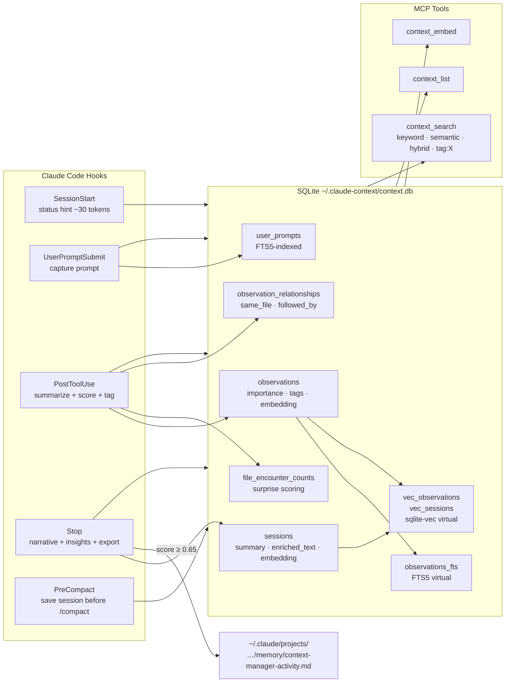

# CLAUDE.md

This file provides guidance to Claude Code when working in this repository.

**Status**: ACTIVE
**Last Updated**: May 25, 2026 (v0.8.34)

---

## Project Overview

**claude-context-manager** is a Claude Code plugin that provides structured session history and searchable context. It automatically captures tool interactions in SQLite with full-text search, and exports high-importance observations to Claude Code's auto-memory topic files.

**Owner**: Larry Smith Jr.
**Email**: mrlesmithjr@gmail.com
**Repository**: `github.com/mrlesmithjr/claude-context-manager`

---

## Development Workflow

This is a TypeScript Claude Code plugin. All code changes follow the mandatory multi-agent sequence:

**Feature or fix:**
```
typescript-developer → code-reviewer → doc-writer → version bump → commit
```

**Documentation only:**
```
doc-writer → commit (no version bump)
```

**Agent responsibilities:**
- `typescript-developer` - implement changes in `src/`, `plugin/hooks/`, `web/`, `cli/`
- `code-reviewer` - quality and security review before any commit (mandatory, never skip)
- `doc-writer` - update this CLAUDE.md, README.md, and any affected skill/agent descriptions

**Version management:**
- Bump patch version after code review passes, before committing: `npm version patch --no-git-tag-version`
- The plugin system caches by version number - if you change code without bumping the version, `/plugin update context-manager` will not apply the changes
- Never bump version before code review is complete

**Issue tracking:**
- Every code change must reference a GitHub issue in the commit (`fixes #N` or `refs #N`)
- Check open issues first: `gh issue list --repo mrlesmithjr/claude-context-manager --state open`

---

## Quick Reference

```bash
# Install from GitHub (recommended):
#   In Claude Code:
#   /plugin marketplace add https://github.com/mrlesmithjr/claude-context-manager
#   /plugin install context-manager
#   Then restart Claude Code

# For local development:
npm run build:plugin
#   In Claude Code:
#   /plugin marketplace add ~/Projects/Personal/claude-context-manager
#   /plugin install context-manager
#   Then restart Claude Code

# Update plugin:
#   /plugin update context-manager
#   Then restart Claude Code
#   NOTE: If update doesn't apply, bump version first (npm version patch)

# Uninstall:
#   In Claude Code: /plugin uninstall context-manager
#   Then optionally run:
npm run plugin:uninstall  # Keep data
npm run plugin:uninstall:all  # Remove all data
```

### MCP Tools (available after install)
- `context_stats` - Show statistics (includes vector search status)
- `context_list` - List recent observations
- `context_search` - Search observations and user prompts (FTS5 keyword)
- `context_semantic_search` - Search sessions by meaning (enriched vector similarity)
- `context_embed` - Generate vector embeddings for semantic search
- `context_vacuum` - Clean up old data
- `context_export` - Export to auto-memory
- `context_memory_audit` - Scan for orphaned memory directories when launch point changes
- `context_memory_consolidate` - Migrate orphaned memories to parent project (dry-run by default)

### Web Dashboard
```bash
npm run web        # Start web dashboard at http://localhost:3847
npm run web:dev    # Development mode with live reload
```

### Import Historical Transcripts
```bash
# Import from backup with path remapping and filtering
npm run import -- \
  --source ~/.claude.backup/projects/-Users-...-OldProject \
  --project ~/Projects/NewProject \
  --filter "optional-keyword" \
  --dry-run  # Remove to actually import
```

---

## Architecture

Direct SQLite access - no background HTTP service required.



---

## Technology Stack

| Component | Technology | Rationale |
|-----------|------------|-----------|
| Language | TypeScript | Type safety, Claude Code ecosystem |
| Database | SQLite + FTS5 + sqlite-vec | No daemon needed — hooks open/query/close in <5ms. FTS5 gives full-text search free. sqlite-vec adds vector similarity. WAL mode handles concurrent hook access. See `docs/ARCHITECTURE.md` "Why SQLite?" for full rationale. |
| Embeddings | @huggingface/transformers (optional) | Local ONNX inference, Xenova/all-MiniLM-L6-v2, 384-dim. No external APIs. |
| Build | esbuild | Fast bundling, ESM output |
| Native Module | better-sqlite3, sqlite-vec | Synchronous API ideal for hooks with tight timeouts (5-10s) |

---

## Directory Structure

```
claude-context-manager/
+-- .claude-plugin/
|   +-- marketplace.json       # Marketplace definition
+-- cli/
|   +-- index.ts               # CLI entry point
+-- plugin/
|   +-- .claude-plugin/
|   |   +-- plugin.json        # Plugin metadata
|   +-- hooks/
|   |   +-- hooks.json         # Hook definitions
|   |   +-- context-inject.ts  # SessionStart: inject past context
|   |   +-- capture-prompt.ts  # UserPromptSubmit: capture prompts
|   |   +-- capture-tool.ts    # PostToolUse: capture interactions
|   |   +-- session-end.ts     # Stop: save summary
|   +-- scripts/               # Built hooks (gitignored)
+-- scripts/
|   +-- install.js             # Prep script (dirs, version sync)
|   +-- uninstall.js           # Cleanup script
|   +-- import-transcripts.ts  # Import historical transcripts from backups
+-- src/
|   +-- capture/
|   |   +-- processor.ts       # Process tool outputs
|   |   +-- remote-client.ts   # HTTP client for hook-to-server calls (remote mode)
|   +-- mcp/
|   |   +-- server.ts          # MCP stdio server entry (loads ~/.claude-context/.env at startup)
|   |   +-- create-server.ts   # MCP server factory (tool definitions, proxy support)
|   +-- server/
|   |   +-- http.ts            # HTTP MCP server (serve command, /mcp + /capture/* + /memory)
|   +-- embedding/
|   |   +-- enrichment.ts      # Session enrichment text builder
|   |   +-- service.ts         # Vector embedding service (HF transformers)
|   +-- export/
|   |   +-- memory.ts          # Auto-memory export pipeline
|   +-- memory/
|   |   +-- audit.ts           # Memory directory audit (orphan detection)
|   |   +-- consolidate.ts     # Memory consolidation (migration + index rebuild)
|   |   +-- index.ts           # Exports
|   +-- inject/
|   |   +-- builder.ts         # Build context for injection (deprecated)
|   +-- storage/
|   |   +-- interface.ts       # Storage interface definition
|   |   +-- sqlite.ts          # SQLite implementation + sqlite-vec
|   +-- utils/
|       +-- classify.ts        # Query classification for retrieval routing (keyword/semantic/hybrid)
|       +-- env.ts             # loadDotEnv() shared utility; reads ~/.claude-context/.env at startup
|       +-- hash.ts            # sha256() for exact dedup, l2DistanceToCosine() for vector search
|       +-- sanitize.ts        # Privacy tag stripping
|       +-- validation.ts      # Input validation
|       +-- version.ts         # Version bump detection (isVersionBump); shared by processor and memory
+-- web/
|   +-- client/
|   |   +-- index.html         # Web UI dashboard
|   +-- server/
|       +-- index.ts           # Fastify server
|       +-- routes/
|           +-- api.ts         # REST API endpoints
+-- test/
|   +-- e2e/
|       +-- setup-data.mjs     # Seed test sessions/observations via SQLiteStorage
|       +-- start-server.mjs   # HTTP server entry (tsc-compiled; avoids CJS/ESM issue with esbuild+fastify)
|       +-- helpers.sh         # mcp_call, mcp_text, assert_* helpers
|       +-- run-all.sh         # Test orchestrator
|       +-- 01-basic-query.sh  # Basic HTTP MCP query scenario
|       +-- 02-cross-project.sh # Cross-project isolation scenario
|       +-- 03-concurrent-writes.sh # WAL concurrent writes scenario
|       +-- 04-stats.sh        # context_stats output scenario
|       +-- 05-remote-capture.sh # Remote capture endpoints scenario
+-- docs/
|   +-- ARCHITECTURE.md        # Detailed architecture
|   +-- ADR-001-web-ui-dashboard.md # Web UI design decision record
+-- dist/                      # Built CLI and web server (gitignored)
+-- Makefile                   # E2E test targets (test-e2e, test-e2e-up, test-e2e-down, e2e-build, e2e-clean)
+-- Dockerfile.e2e             # Docker image for E2E tests (Node 20 slim, builds from source)
+-- docker-compose.e2e.yml     # E2E orchestration (context-server + test-runner)
+-- package.json
+-- tsconfig.json
+-- CLAUDE.md                  # This file
+-- README.md                  # User documentation
```

---

## Key Design Decisions

### 1. Direct SQLite (No HTTP Service)
- Hooks access SQLite directly via better-sqlite3
- Simpler than HTTP service architecture
- No background process to manage

### 2. Hierarchical Project Scoping
- Observations are scoped by `project` (derived from `cwd`)
- Uses **prefix matching** (`WHERE project LIKE path%`)
- Parent directories see all child project contexts
- Sibling projects are naturally isolated

**Visibility example:**
| Working From | Sees |
|--------------|------|
| `~/Projects/Work/ProjectA` | Only ProjectA contexts |
| `~/Projects/Work` | All Work/* children (ProjectA, ProjectB, etc.) |
| `~/Projects` | Everything |

### 3. hookSpecificOutput Format
- SessionStart hook returns:
  ```json
  {
    "hookSpecificOutput": {
      "hookEventName": "SessionStart",
      "additionalContext": "<claude-context>...</claude-context>"
    }
  }
  ```
- This format is compatible with Claude's extended thinking mode
- Learned from claude-mem implementation

### 4. Observation Summarization (v0.8.2)
- Extract: tool name, files touched, patterns — no AI extraction (unlike claude-mem)
- **Edit summaries** use pattern matching on the diff to produce meaningful descriptions:
  - Function/class/const additions → `"Added async getRecentSessionsWithObservations"`
  - Import changes → `"Added import from '../utils/session-format.js'"`
  - Interface/type additions, schema changes (CREATE/ALTER TABLE)
  - Net line count for larger diffs (`"Added ~12 lines"`)
  - First meaningfully different line as fallback
  - Finds actually-different lines (set difference) rather than raw first-line truncation
- Trade-off: Less intelligent than AI extraction, but deterministic and fast

### 5. Importance Scoring at Capture Time
- Every observation gets an importance level (high/medium/low) and numeric score (0.0-1.0)
- Base scores by tool type: Edit/Write (0.80), git commit (0.90), Read (0.30), Grep (0.25)
- Adjustments: errors (+0.25), config files (+0.15), test files (+0.10), lock files (-0.30)
- Scored at capture time (no post-hoc reprocessing needed)

### 5a. Conversation Insight Extraction (v0.6.4)
- At session end, the Stop hook scans all assistant text blocks in the transcript
- Scores each block for high-signal patterns: markdown tables, recommendations, price comparisons, user fact confirmations
- Top 10 blocks (by score) saved as `Conversation` observations with compressed summaries (~150 tokens each)
- This captures synthesized knowledge (comparisons, decisions, recommendations) that previously only existed in raw conversation and was lost between sessions
- Compression extracts tables, headers, bullet points with data, and decision language — discards filler text

### 6. Auto-Memory Export (v0.4.0)
- High-importance observations (score >= 0.65) exported to `~/.claude/projects/<path>/memory/context-manager-activity.md`
- Export happens at session end (Stop hook), not session start
- Writes to a dedicated topic file — never touches MEMORY.md
- SessionStart injects a minimal status hint (~30 tokens) instead of raw observation lists
- Complements Claude Code's built-in auto-memory rather than competing with it

### 8. Vector Embedding Search (v0.5.5, enriched in v0.6.0)
- sqlite-vec extension loaded at database open (graceful fallback if unavailable)
- **Observation embeddings**: `embedding BLOB` column on observations + `vec_observations` vec0 virtual table (384-dim)
- **Session embeddings** (v0.6.0): `embedding BLOB` + `enriched_text TEXT` on sessions + `vec_sessions` vec0 virtual table
  - Enriched text assembled from user prompts + high-value observations + session summary (~200-500 tokens)
  - Provides much higher semantic signal than per-observation embeddings
  - `context_semantic_search` defaults to session scope with observation fallback
- Embeddings generated on-demand via `context_embed` MCP tool (NOT at capture time — avoids hook latency)
- Background embedding runs automatically on startup for new observations and sessions: on stdio MCP server startup (when not in proxy mode) and on HTTP server startup
- First-time setup: run `context_embed` once to auto-install dependencies and bootstrap
- `@huggingface/transformers` is an optional dependency — all other features work without it
- Model: `Xenova/all-MiniLM-L6-v2` (~80MB, cached to `~/.cache/huggingface/`)

### 9. Rule-Based Compaction
- Old observations (>7 days) compressed into summaries during vacuum
- Groups by session + tool, only compact groups of 3+
- Never compacts high-importance observations
- Format: `"Read x4: file1.ts, file2.ts, ..."` (~15 tokens vs ~80)
- Vector rows in `vec_observations` are deleted before their source observation rows are deleted. Orphaned vector entries would otherwise accumulate silently across compaction cycles and never be cleaned up.

### 10. Surprise Scoring (v0.7.0)
- File encounter frequency tracked in `file_encounter_counts` table (per file + project + tool)
- At capture time, importance_score is adjusted based on novelty:
  - First encounter: +0.15, encounters 2-3: +0.05, 11+: -0.10
  - Total cap: [-0.15, +0.20] to prevent dominating base score
- Uses **7-day windowed count** from observations for scoring (not lifetime counter)
  - Files untouched for a week feel novel again
  - Lifetime counter still maintained in `file_encounter_counts` for analytics
- Novel files surface above routine reads of the same files

### 11. Observation Relationships (v0.7.0)
- `observation_relationships` table links observations passively at capture time
- Two relationship types inferred automatically:
  - `followed_by` — sequential observations in the same session
  - `same_file` — observations touching the same file (within 24h, same project)
- `ON DELETE CASCADE` ensures cleanup during compaction/vacuum
- `getRelatedObservations()` enables bidirectional graph traversal
- `context_search` enriches top results with related observations

### 12. Retrieval Routing (v0.7.0)
- `context_search` auto-classifies queries and picks the optimal search strategy:
  - **keyword** (1-2 words, file names, identifiers) → FTS5 only (fast path)
  - **semantic** (5+ words, natural language questions) → vector search (sessions then observations)
  - **hybrid** (3-4 words, mixed) → both FTS5 + vector, merged with Reciprocal Rank Fusion (k=60)
- Graceful degradation: if embeddings unavailable, all strategies fall back to keyword
- Search method included in output for transparency

### 13. Session Narrative Selection (v0.8.3)
- The Stop hook previously used the **last** assistant message as the session summary — often a closing remark ("Yes.", "Now bump the version...")
- Now scores all assistant messages for narrative quality and picks the best candidate
- Scorer (`scoreForNarrative`) favors messages that describe work done:
  - Action verbs: implement, add, fix, update, create, refactor, replace, rewrite (+0.20)
  - File path references like `processor.ts`, `sqlite.ts` (+0.15)
  - Code blocks (+0.10), bullet lists (+0.10), longer messages (+0.15/+0.10)
  - Short affirmations ("Yes", "Sure", "Ok", "Let me...") score 0 even if they pass length check
- Best-scoring message used if score >= 0.25; falls back to last assistant message otherwise
- Result: session narratives in `context_list` now reflect what was accomplished, not how the session closed

### 14. Domain Tag Inference (v0.8.6)
- Every observation gets domain tags inferred at capture time from file paths and Bash commands
- Tags stored as comma-separated string in `tags TEXT` column (added via migration, NULL for old observations)
- 10 tag categories: `auth`, `database`, `testing`, `infra`, `config`, `frontend`, `api`, `git`, `build`, `deps`
- Inference rules: file path pattern matching (e.g., `/auth/`, `sqlite`, `.test.`) + Bash command patterns (e.g., `git commit` → `git`, `npm run build` → `build`)
- Multiple tags per observation are normal (e.g., a test migration file gets both `database` and `testing`)
- `context_search` supports `tag:X` prefix to route directly to tag-filtered search, bypassing FTS5/vector routing
- `tag:X keyword` syntax further filters tag results by FTS5 keyword (intersection)
- Tags visible in `context_search` output as `[auth, config]` suffix on each observation line
- Partial index on `tags WHERE tags IS NOT NULL` keeps tag queries fast without scanning NULL rows
- **Tag matching uses delimiter-anchored LIKE** (`',' || tags || ','` matched against `%,tag,%`): prevents substring collisions where e.g. `api` would incorrectly match `api_key`, and correctly matches tags in all positions including first and last

### 15. Security and Input Validation (Sprint 1 P0)

**Hook input path validation:**
- `validateStopInput`: `transcript_path` is resolved with `realpathSync` (symlink-safe) and must remain within `~/.claude/projects/` before use. Paths that resolve outside this boundary are silently dropped rather than used. This prevents directory traversal via crafted or symlinked paths.
- `validateSessionStartInput`: when path validation fails, the fallback is `process.cwd()` then `homedir()`. Raw untrusted input is never used as the fallback, which would cause over-broad database scoping (a parent-directory path would expose unrelated project contexts).

**Debug log discipline:**
- `capture-prompt.ts` and `session-end.ts` no longer write raw prompt content or raw stdin to debug logs. Only metadata is logged (session ID, content length, key names). This prevents sensitive prompt content from appearing in log files.

**Storage correctness fixes:**
- `searchPrompts` uses `ftsQuery` (the FTS5-escaped form) in the `ELSE` branch, not the raw query string. Queries containing dots, hyphens, or FTS5 boolean operators no longer cause parse errors.
- `getWithinBudget` has a `LIMIT 500` and orders by `importance_score DESC, created_at DESC`. Without the limit, context injection could grow unbounded on mature databases with thousands of observations.
- `compactObservations` deletes rows from `vec_observations` before deleting the source observation rows. Without this, compaction leaves orphaned vector rows that accumulate and are never cleaned up.
- `session-end.ts` error path uses `await writeResponse({ status: 'error' })` (async, consistent with all other exit paths) instead of synchronous `process.stdout.write`. The sync write could fail to flush before the process exited.

### 16. Remote Capture Mode (v0.8.27)

When `CONTEXT_MANAGER_URL` is set, hooks operate as thin HTTP clients that POST captures to a central context-manager server instead of writing to local SQLite. This enables a single shared database across multiple machines (e.g., desktop + laptop + dev container).

**Architecture split:**
- `src/capture/remote-client.ts` provides typed wrappers for all hook-to-server calls: `remoteCreateSession`, `remoteEndSession`, `remoteSaveObservation`, `remoteSavePrompt`, `remoteExportMemory`, `remoteGetMemory`, `remoteMcpText`.
- `src/server/http.ts` provides the server-side counterparts. Start with: `CONTEXT_MANAGER_TOKEN=<secret> node dist/cli.js serve --port 4666`

**Server endpoints** (all require Bearer auth except `/health`):
- `POST /capture/session` — create or end a session (`action: 'create' | 'end'`)
- `POST /capture/observation` — save one observation from a remote hook
- `POST /capture/prompt` — save one user prompt from a remote hook
- `POST /capture/export` — trigger server-side `exportToAutoMemory`, returns exported content
- `GET /memory?project=...` — return current server-side memory file content (read-only, no side effects)
- `POST /mcp` / `GET /mcp` — StreamableHTTP MCP transport (existing tools: `context_search`, `context_list`, etc.)

**Hook behavior changes in remote mode:**
- `CONTEXT_MANAGER_URL` set without `CONTEXT_MANAGER_TOKEN`: hooks abort loudly with an error message. No silent fallback to local mode.
- `context-inject.ts`: creates session remotely, fetches `context_stats` via `remoteMcpText`, fetches `GET /memory` content for injection (capped at 3000 chars). Local SQLite is never opened.
- `session-end.ts`: POSTs insights and session-end data to server, then triggers `POST /capture/export`.
- `capture-tool.ts`: surprise scoring is skipped (requires DB access; no local DB in remote mode).
- All hooks defer `SQLiteStorage` construction to local mode only — remote mode has zero local SQLite footprint.

**Token requirement enforcement:**
- Server startup fails immediately if `CONTEXT_MANAGER_TOKEN` is not set (there is no loopback exemption for the HTTP MCP server, unlike the web dashboard).
- All endpoints use constant-time comparison (`crypto.timingSafeEqual`) to prevent timing-oracle attacks on the token.

**E2E coverage:** `test/e2e/05-remote-capture.sh` (9 assertions covering session create/end, observation, prompt, export, and memory endpoints). Total: 5 scenarios, 36 assertions.

**stdio MCP server .env loading (v0.8.30):**

Claude Code does NOT inject `settings.json` `env` vars into stdio MCP server processes. Environment variables defined there reach hook subprocesses but are invisible to the MCP server spawned via `.mcp.json`. This means `CONTEXT_MANAGER_URL` would never be seen by the stdio server, so proxy mode would never activate even if the user configured the URL correctly.

The fix: `src/mcp/server.ts` calls `loadDotEnv()` at startup (before any proxy configuration is read). This reads `~/.claude-context/.env` and populates `process.env` with any keys not already set. When `CONTEXT_MANAGER_URL` is present in the file, proxy mode activates automatically. Existing `process.env` values always take priority — `loadDotEnv()` never overrides.

The `.env` file is already written by `make server-init`, so users who follow the server setup instructions get proxy mode for free on the next MCP server restart. No additional configuration step is required.

**Hook .env loading (v0.8.32):**

Extended the same `loadDotEnv()` pattern to all four hooks (`context-inject.ts`, `capture-tool.ts`, `capture-prompt.ts`, `session-end.ts`). `loadDotEnv()` was extracted into `src/utils/env.ts` as a shared utility. Hooks call it as the first statement in `main()`, before any `process.env` reads.

Combined with the MCP server's existing `.env` loading, this means the entire remote mode setup requires no shell configuration at all: run `make server-quickstart` (macOS) or `make server-init && make server-start` (Linux), restart Claude Code, and proxy mode activates automatically.

### 17. Native Server on macOS (Docker incompatible)

The `docker-compose.server.yml` Docker approach for local server deployment does NOT work on macOS. Docker Desktop uses a Linux VM with VirtioFS for bind mount filesystem sharing. SQLite WAL mode requires POSIX advisory file locks and shared memory (`-shm` files) that do not work correctly across this virtualization layer.

Attempting to mount `~/.claude-context/` as a Docker bind mount on macOS causes:
- `database disk image is malformed (11)` errors
- WAL files left in inconsistent state
- Potential corruption of page 1 (SQLite header page)

**For macOS:** Use `make server-launchd-install` to run the server natively as a Node.js process. The `scripts/com.mrlesmithjr.context-manager.plist.template` is filled with `NODE_PATH`, `PROJECT_ROOT`, `HOME`, and `TOKEN` placeholders by the Makefile target, then installed to `~/Library/LaunchAgents/`.

**For Linux:** Docker bind mounts use a direct filesystem passthrough without a VM layer, so SQLite WAL locking works correctly. The existing `make server-start` (docker-compose.server.yml) is the correct approach on Linux.

### 18. Periodic Checkpoint Export (v0.8.34)

**Problem:** The Stop hook runs at session end, but sessions can terminate abnormally: a crash, a `/compact` mid-session, or a long-running session where the user wants observations persisted before the session is over. In all three cases, auto-memory export never fires and the session's high-importance observations are not reflected in the memory file until the next clean Stop.

**What it does:** The `UserPromptSubmit` hook (capture-prompt.ts) now runs a lightweight checkpoint before acknowledging each prompt. The checkpoint is gated by an elapsed-time check so it only executes when enough time has passed since the last checkpoint (or session start). Each checkpoint:

1. Calls `exportToAutoMemory` to write high-importance observations (score >= 0.65) to `~/.claude/projects/.../memory/context-manager-activity.md`.
2. Scores all assistant messages seen so far in the transcript and writes the best-scoring one as a draft summary to `sessions.summary` via `updateSessionDraftSummary`.
3. Records the current timestamp in `sessions.last_checkpoint_at` via `updateSessionCheckpoint`.
4. Skips entirely if the session has no observations yet (nothing to export).

**3-second wall-clock guard:** The checkpoint races against a 3-second timeout. If the export takes longer (e.g., model loading on first run), the prompt is acknowledged immediately and the checkpoint result is discarded. The UserPromptSubmit hook has a 5-second budget; the guard keeps checkpoint overhead well within that limit.

**Configurable interval:** `CONTEXT_MANAGER_CHECKPOINT_INTERVAL` (default: 30 minutes). Set lower in development, higher if you prefer less I/O. The interval is read from `process.env` after `loadDotEnv()` runs, so it can be placed in `~/.claude-context/.env`.

**Schema change:** `last_checkpoint_at INTEGER` column added to the `sessions` table via the existing migration system. NULL means no checkpoint has run; `started_at` is used as the baseline in that case.

**Remote mode trade-off:** In remote mode there is no local DB to query for `last_checkpoint_at` or the observation count, so the elapsed-time check is skipped and `remoteExportMemory` is called on every prompt. The server-side export pipeline has its own dedup logic (only writes when there is new content), so the extra calls are low-cost.

**Shared utility extraction:** `scoreForNarrative`, `pickBestNarrative`, and `extractTextFromTranscriptLine` were extracted from `session-end.ts` into `src/utils/transcript.ts` so both the Stop hook and the checkpoint can share the same narrative-selection logic.

---

## Data Storage

All data stored in `~/.claude-context/`:

```
~/.claude-context/
+-- context.db          # SQLite database
+-- logs/               # Debug logs (optional)
```

---

## Hook Response Formats

### SessionStart
```json
{
  "hookSpecificOutput": {
    "hookEventName": "SessionStart",
    "additionalContext": "markdown context string"
  }
}
```

### PostToolUse
```json
{
  "status": "captured" | "skipped" | "error"
}
```

### Stop
```json
{
  "status": "complete" | "error"
}
```

---

## Development Commands

```bash
# Install dependencies
npm install

# Build all components (src, hooks, CLI, web)
npm run build

# Type check only
npm run typecheck

# Clean build artifacts
npm run clean

# Build and prepare plugin for installation
npm run build:plugin

# Uninstall plugin (keep data)
npm run plugin:uninstall

# Uninstall plugin (remove data)
npm run plugin:uninstall:all

# Run CLI
npm run cli -- stats
npm run cli -- list --limit 10
npm run cli -- search "query"
npm run cli -- export --dry-run

# Import historical transcripts
npm run import -- --source <path> --project <target> [--filter <text>] [--dry-run]

# Web dashboard
npm run web        # Start server at http://localhost:3847
npm run web:dev    # Development mode with live reload

# E2E tests (Docker-based)
make test-e2e      # Build, run all E2E scenarios, and tear down (CI-safe)
make test-e2e-up   # Start E2E services only (for manual exploration)
make test-e2e-down # Stop and remove E2E containers and ephemeral volume
make e2e-build     # Build E2E Docker image only
make e2e-clean     # Stop containers and remove the Docker image

# Local HTTP server — Docker (Linux only; see Design Decision #17 for macOS)
make server-init   # Generate token, write ~/.claude-context/.env (idempotent)
make server-env    # Print remote mode environment summary
make server-start  # Build image (if needed) and start server in background
make server-stop   # Stop the Docker server
make server-logs   # Tail Docker server logs
make server-status # Health check for Docker server

# Local HTTP server — native process (macOS recommended)
make server-native-start  # Start server natively in background (reads ~/.claude-context/.env)
make server-native-stop   # Stop native background server (uses server.pid or lsof fallback)
make server-native-status # Health check for native server

# Local HTTP server — launchd (macOS persistent startup across reboots)
make server-launchd-install    # Fill plist template and install to ~/Library/LaunchAgents/
make server-launchd-uninstall  # Unload and remove launchd plist
make server-launchd-status     # Check launchd agent status via launchctl list
make server-quickstart         # macOS all-in-one: init token + install launchd + start server
```

---

## Configuration

Environment variables (optional):

| Variable | Default | Description |
|----------|---------|-------------|
| `CONTEXT_MANAGER_DB` | `~/.claude-context/context.db` | Database path |
| `CONTEXT_MANAGER_TOKEN_BUDGET` | `4000` | Max tokens for context injection |
| `CONTEXT_MANAGER_PORT` | `3847` | Web dashboard port |
| `CONTEXT_MANAGER_HOST` | `localhost` | Web dashboard host |
| `CONTEXT_SEARCH_MIN_SCORE` | `0.25` | Minimum cosine similarity for semantic/hybrid search results; FTS5 results are never filtered |
| `CONTEXT_MANAGER_URL` | _(unset)_ | When set, hooks POST to this URL instead of writing local SQLite (remote capture mode). All hooks and the stdio MCP server read this from `~/.claude-context/.env` automatically; no shell export needed. |
| `CONTEXT_MANAGER_TOKEN` | _(unset)_ | Bearer token for remote capture mode and HTTP MCP server; required when `CONTEXT_MANAGER_URL` is set |
| `CONTEXT_MANAGER_CHECKPOINT_INTERVAL` | `30` | Minutes between periodic checkpoint exports during a live session (see Design Decision #18) |

---

## Privacy

The `<private>` tag excludes content from storage:

```xml
<private>
API_KEY=sk-abc123...
</private>
```

Content within `<private>` tags is replaced with `[REDACTED]` before storage.

**Hardened behaviors (Sprint 1 P0):**
- **Unclosed `<private>` tag**: if the closing `</private>` is absent, all remaining content after the opening tag is redacted rather than stored verbatim. This closes the partial-tag leak vector.
- **Edit/Write field stripping**: `old_string`, `new_string`, and `content` fields are removed from Edit/Write `tool_input` metadata before storage. These fields can contain diff content with secrets that would otherwise bypass `SENSITIVE_PATTERNS` matching. The observation still captures the file path and operation type.

---

## Hooks Registered

The plugin uses the Claude Code marketplace plugin system to register hooks.

| Hook | Purpose | Timeout | Matcher |
|------|---------|---------|---------|
| `SessionStart` | Create session, inject status hint | 10s | `startup\|clear\|compact` |
| `UserPromptSubmit` | Capture user prompts | 5s | - |
| `PostToolUse` | Capture tool interactions | 5s | `*` |
| `Stop` | Save summary, extract conversation insights, export to auto-memory | 10s | - |
| `PreCompact` | Save session before /compact | 10s | - |

**Installation mechanism:**
- Hook definitions: `plugin/hooks/hooks.json`
- Built scripts: `plugin/scripts/` (generated by build process)
- Plugin metadata: `plugin/.claude-plugin/plugin.json`
- Marketplace metadata: `.claude-plugin/marketplace.json`

When installed via `/plugin install context-manager`, Claude Code:
1. Copies the plugin to `~/.claude/plugins/`
2. Registers hooks defined in `hooks.json`
3. Resolves `${CLAUDE_PLUGIN_ROOT}` to the installed plugin directory
4. Executes hook scripts on the appropriate events

---

## Related Projects

- **claude-mem** (thedotmack): Full-featured memory plugin with Agent SDK, ChromaDB, viewer UI
- Reference implementation for hook response formats and native module handling

---

## Troubleshooting

### E2E server uses tsc output, not the esbuild bundle

`test/e2e/start-server.mjs` imports from `dist/` (tsc-compiled) rather than the esbuild-bundled `dist/cli.js`. esbuild inlines fastify's internal `require()` calls into an ESM bundle, which Node.js rejects at runtime with a CJS/ESM incompatibility error. The tsc output preserves the original module boundaries and avoids this.

If E2E tests fail to start the server, ensure `npm run build` has run (it compiles both tsc and esbuild targets).

### Native module errors
```bash
# Rebuild native modules
npm rebuild better-sqlite3
```

### Check if plugin is installed
```bash
# In Claude Code
/plugin list

# Or check the installed plugins
cat ~/.claude/plugins/installed_plugins.json | jq '.plugins["context-manager@mrlesmithjr"]'
```

### Test hooks manually
```bash
echo '{"cwd":"'$(pwd)'"}' | node ~/.claude/plugins/cache/mrlesmithjr/context-manager/*/scripts/context-inject.js
```

### Check database stats
Use the `context_stats` MCP tool in Claude Code or run the CLI directly from the project directory.

### Updates not applying (IMPORTANT)

The plugin system caches by version number. If you modify code but don't bump the version, updates won't apply.

**For local development:**
1. Bump version: `npm version patch --no-git-tag-version`
2. Rebuild: `npm run build:plugin`
3. Update in Claude Code: `/plugin update context-manager`
4. Restart Claude Code

**If update still doesn't apply:**
```
/plugin uninstall context-manager
/plugin install context-manager
```
Then restart Claude Code.

**From GitHub:** Updates should work automatically since each push has a new commit SHA.
