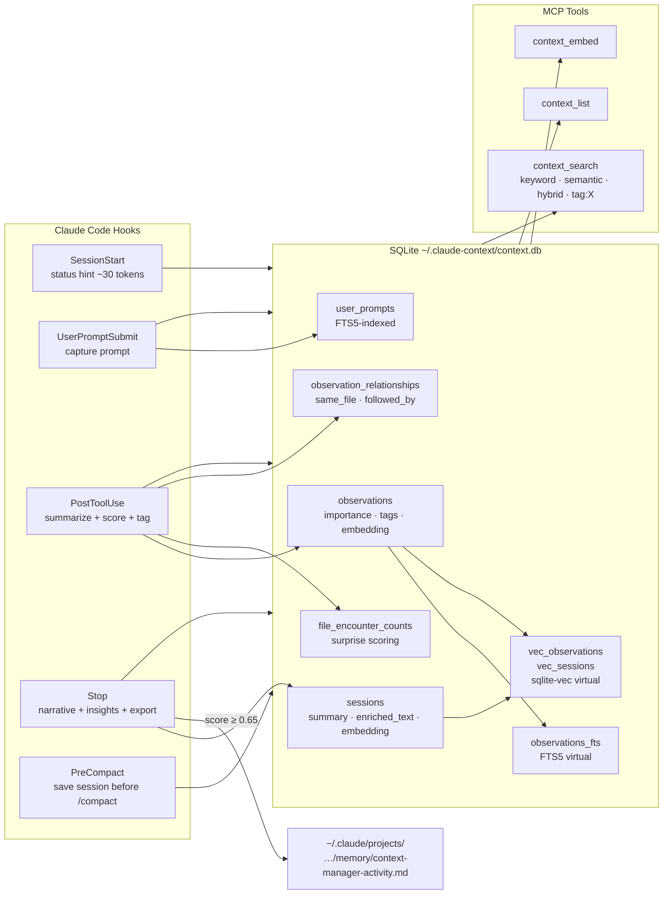

# CLAUDE.md

This file provides guidance to Claude Code when working in this repository.

**Status**: ACTIVE
**Last Updated**: May 25, 2026 (v0.8.56)

---

## Project Overview

**claude-context-manager** is a Claude Code plugin that provides structured session history and searchable context. It automatically captures tool interactions in SQLite with full-text search, and exports high-importance observations to Claude Code's auto-memory topic files.

**Owner**: Larry Smith Jr. | **Email**: mrlesmithjr@gmail.com
**Repository**: `github.com/mrlesmithjr/claude-context-manager`

---

## Development Workflow

This is a TypeScript Claude Code plugin. All code changes follow the mandatory multi-agent sequence:

**Feature or fix:** `typescript-developer → code-reviewer → doc-writer → version bump → commit`

**Documentation only:** `doc-writer → commit (no version bump)`

**Agent responsibilities:**
- `typescript-developer` - implement changes in `src/`, `plugin/hooks/`, `web/`, `cli/`
- `code-reviewer` - quality and security review before any commit (mandatory, never skip)
- `doc-writer` - update this CLAUDE.md, README.md, and any affected skill/agent descriptions

**Version management:**
- Bump patch version after code review passes: `npm version patch --no-git-tag-version`
- The plugin system caches by version number - bump before `/plugin update context-manager` or changes won't apply
- Never bump before code review is complete

**Issue tracking:**
- Every code change must reference a GitHub issue in the commit (`fixes #N` or `refs #N`)
- Check open issues first: `gh issue list --repo mrlesmithjr/claude-context-manager --state open`

---

## Quick Reference

```bash
# Build
npm run build           # All components (src, hooks, CLI, web)
npm run build:plugin    # Build + prepare for plugin install
npm run typecheck       # Type check only
npm run clean           # Clean build artifacts

# CLI
npm run cli -- stats
npm run cli -- list --limit 10
npm run cli -- search "query"
npm run cli -- export --dry-run

# Web dashboard
npm run web             # http://localhost:3847
npm run web:dev         # Live reload
# Import tab: upload ~/.claude-context/context.db to migrate to Docker

# E2E tests
make test-e2e           # Build, run all scenarios, tear down (CI-safe)

# Remote server — macOS (launchd, persists across reboots)
make server-quickstart  # Init token + install launchd + start

# Remote server — Linux (Docker)
make server-init && make server-start

# Import historical transcripts
npm run import -- --source <path> --project <target> [--filter <text>] [--dry-run]
```

**MCP Tools:**
`context_add`, `context_stats`, `context_list`, `context_search`, `context_semantic_search`, `context_embed`,
`context_vacuum`, `context_export`, `context_memory_audit`, `context_memory_consolidate`

---

## Architecture

Direct SQLite access - no background HTTP service required.



---

## Technology Stack

| Component | Technology |
|-----------|------------|
| Language | TypeScript |
| Database | SQLite + FTS5 + sqlite-vec (no daemon, WAL mode, hooks open/query/close in <5ms) |
| Embeddings | @huggingface/transformers optional (Xenova/all-MiniLM-L6-v2, 384-dim, local ONNX) |
| Build | esbuild (ESM output) |
| Native modules | better-sqlite3, sqlite-vec (sync API ideal for hook timeouts) |

---

## Directory Structure

```
claude-context-manager/
+-- cli/index.ts                    # CLI entry point
+-- plugin/
|   +-- .claude-plugin/plugin.json  # Plugin metadata
|   +-- hooks/
|   |   +-- hooks.json              # Hook definitions
|   |   +-- context-inject.ts       # SessionStart
|   |   +-- capture-prompt.ts       # UserPromptSubmit + periodic checkpoint
|   |   +-- file-context.ts         # PreToolUse: inject file history before Read
|   |   +-- capture-tool.ts         # PostToolUse
|   |   +-- session-end.ts          # Stop
|   +-- scripts/                    # Built hooks (gitignored)
+-- src/
|   +-- capture/processor.ts        # Process tool outputs + scoring
|   +-- capture/remote-client.ts    # HTTP client for remote mode
|   +-- mcp/server.ts               # MCP stdio server (loads .env at startup)
|   +-- mcp/create-server.ts        # MCP server factory
|   +-- server/http.ts              # HTTP MCP server (serve command)
|   +-- embedding/enrichment.ts     # Session enrichment text builder
|   +-- embedding/service.ts        # Vector embedding service
|   +-- export/memory.ts            # Auto-memory export pipeline
|   +-- memory/                     # Memory audit and consolidation
|   +-- storage/interface.ts        # Storage interface
|   +-- storage/sqlite.ts           # SQLite implementation + sqlite-vec
|   +-- utils/classify.ts           # Query routing (keyword/semantic/hybrid)
|   +-- utils/env.ts                # loadDotEnv() shared utility
|   +-- utils/transcript.ts         # scoreForNarrative, pickBestNarrative
|   +-- utils/sanitize.ts           # <private> tag stripping
+-- web/                            # Fastify web dashboard
+-- test/e2e/                       # Docker-based E2E scenarios (5 scenarios, 36 assertions)
+-- docs/ARCHITECTURE.md            # Full design decision details
+-- Makefile                        # All build, server, and E2E targets
```

---

## Key Design Decisions

Full details in `docs/ARCHITECTURE.md`. Quick reference:

| # | Decision | Key behavior |
|---|----------|-------------|
| 1 | Direct SQLite | No daemon; hooks access DB directly via better-sqlite3 |
| 2 | Hierarchical project scoping | `WHERE project LIKE path%` — parent dirs see all children |
| 3 | hookSpecificOutput format | SessionStart returns `{ hookSpecificOutput: { hookEventName, additionalContext } }` |
| 4 | Observation summarization | Pattern-matched edit summaries (no AI); deterministic and fast |
| 5 | Importance scoring | Edit/Write=0.80, git commit=0.90, Read=0.30, Grep=0.25; errors +0.25, lock files -0.30 |
| 5a | Conversation insights | Stop hook extracts top 10 assistant blocks as `Conversation` observations |
| 6 | Auto-memory export | Score >= 0.65 exported to `memory/context-manager-activity.md` at Stop |
| 8 | Vector search | sqlite-vec, session embeddings (enriched text), on-demand via `context_embed` |
| 9 | Rule-based compaction | >7 days old, groups of 3+, never compacts high-importance |
| 10 | Surprise scoring | First encounter +0.15; 7-day windowed count; cap [-0.15, +0.20] |
| 11 | Observation relationships | `followed_by`, `same_file`, `cross_project_same_file` inferred at capture |
| 12 | Retrieval routing | 1-2 words=keyword, 3-4=hybrid (RRF), 5+=semantic |
| 13 | Session narrative selection | Scores all assistant messages; picks best (>= 0.25); falls back to Conversation obs |
| 14 | Domain tag inference | 10 categories from file paths + Bash commands; `tag:X` prefix in search |
| 15 | Security/validation | Path traversal protection, no raw prompts in debug logs, LIMIT 500 on context budget |
| 16 | Remote capture mode | `CONTEXT_MANAGER_URL` in `.env` enables HTTP proxy; token required; hooks read `.env` |
| 17 | macOS native server | Docker + SQLite WAL + macOS VirtioFS = corruption; use `make server-launchd-install` |
| 18 | Periodic checkpoint | Every 30 min in UserPromptSubmit; 3s wall-clock guard; `CONTEXT_MANAGER_CHECKPOINT_INTERVAL` |
| 19 | PreToolUse file context | Injects prior session history on first Read per file per session (min 2 prior obs) |
| 20 | Stale session GC | Auto-runs on SessionStart; marks sessions inactive > 2h as `complete` |
| 21 | Manual write path | `context_add` MCP tool; daily manual session per project; `source='manual'` in sessions; no tag inference from free text |
| 22 | Bash skip threshold | Bash observations scoring < 0.15 are dropped before DB write; gate runs after all scoring adjustments so error-signal commands (score boosted +0.25) are preserved |
| 23 | MCP summary cap | MCP tool summaries truncated to ~40 tokens (160 chars) when importance < 0.3; observation still stored for relationship tracking and dedup |
| 24 | Bearer token injection | Web server dynamically serves `index.html` with `window.__CTX_TOKEN` injected before `</head>`; `Cache-Control: no-store`; GET / bypassed from auth hook |
| 25 | Network mode project scoping | `isNetworkMode = token.length > 0`; all components gate fetch + render behind project selection; `ProjectFilter` auto-selects first project on load |
| 26 | Continuous embedding loop | `backgroundEmbed(storage, signal)` accepts an `AbortSignal`; loops on `while (!signal.aborted)`; `abortableSleep()` throws on abort; `CONTEXT_MANAGER_EMBED_INTERVAL` controls sleep; errors caught per-iteration; NaN guard on env var |
| 28 | Clean HTTP server shutdown | `abortController.abort()` signals the embed loop to stop; shutdown races `embedTask` against a 3s deadline before calling `fastify.close()` then `storage.close()`; `shuttingDown` flag prevents concurrent double-shutdown; startup failure path removes signal handlers before closing storage; both launchd plist templates include `ThrottleInterval: 30` to prevent rapid restart loops |
| 27 | SQLite DB import | `POST /api/import` on web server; multipart upload; magic byte + PRAGMA schema pre-flight; ATTACH/INSERT OR IGNORE in single transaction; skips vec tables and observation_relationships |

---

## Hooks Registered

| Hook | Purpose | Timeout | Matcher |
|------|---------|---------|---------|
| `SessionStart` | Create session, inject status hint, run stale session GC | 10s | `startup\|clear\|compact` |
| `UserPromptSubmit` | Capture prompts, periodic checkpoint export | 5s | - |
| `PreToolUse` | Inject file history before Read | 5s | `Read` |
| `PostToolUse` | Capture tool interactions | 5s | `*` |
| `Stop` | Save summary, extract insights, export to auto-memory | 10s | - |
| `PreCompact` | Save session before /compact | 10s | - |

Hook response formats:
- **SessionStart**: `{ hookSpecificOutput: { hookEventName: "SessionStart", additionalContext: "..." } }`
- **PostToolUse**: `{ status: "captured" | "skipped" | "error" }`
- **Stop**: `{ status: "complete" | "error" }`

---

## Configuration

All env vars read from `~/.claude-context/.env` (loaded at hook and MCP server startup):

| Variable | Default | Description |
|----------|---------|-------------|
| `CONTEXT_MANAGER_DB` | `~/.claude-context/context.db` | Database path |
| `CONTEXT_MANAGER_TOKEN_BUDGET` | `4000` | Max tokens for context injection |
| `CONTEXT_MANAGER_PORT` | `3847` | Web dashboard port |
| `CONTEXT_SEARCH_MIN_SCORE` | `0.25` | Min cosine similarity for semantic/hybrid results |
| `CONTEXT_MANAGER_URL` | _(unset)_ | Remote capture server URL (enables proxy mode) |
| `CONTEXT_MANAGER_TOKEN` | _(unset)_ | Bearer token; required when URL is set |
| `CONTEXT_MANAGER_CHECKPOINT_INTERVAL` | `30` | Minutes between checkpoint exports |
| `CONTEXT_MANAGER_EMBED_INTERVAL` | `10` | Minutes between background embedding passes in HTTP server; invalid values fall back to 10 |

---

## Privacy

Wrap sensitive content in `<private>` tags to redact before storage:

```xml
<private>
API_KEY=sk-abc123...
</private>
```

Unclosed tags redact all remaining content. `old_string`/`new_string`/`content` fields are stripped from Edit/Write observations before storage.

---

## Troubleshooting

**Updates not applying:** The plugin caches by version number. Always `npm version patch --no-git-tag-version` before `/plugin update context-manager`. If still stale: `/plugin uninstall context-manager` then `/plugin install context-manager`, then restart.

**Native module errors:** `npm rebuild better-sqlite3`

**E2E server startup fails:** Ensure `npm run build` has run first (E2E uses tsc output, not the esbuild bundle — esbuild inlines fastify's `require()` calls which Node.js rejects as CJS/ESM conflict).
