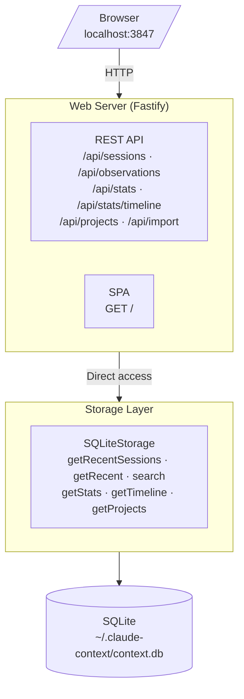

# ADR-001: Web UI Dashboard

## Status

Implemented (v0.3.0+, current as of v0.8.95)

---

## Context

The claude-context-manager plugin captures session history and provides MCP tools (`context_stats`, `context_list`, `context_search`) for programmatic access. Users needed a richer interface for browsing large session histories, visualizing token usage over time, and inspecting observations without writing queries.

### Constraints

- Must reuse the existing storage layer (`src/storage/sqlite.ts`) without a migration
- Native module handling — `better-sqlite3` requires special bundling (no esbuild `require()` inlining)
- Should not require a separate build pipeline for frontend code
- Must work with the existing esbuild + TypeScript 5.3+ + Node 18+ toolchain

---

## Decision

A lightweight local web dashboard built with:

| Component | Technology | Rationale |
|-----------|------------|-----------|
| API server | Fastify | TypeScript-native, low overhead (~200 KB), built-in JSON schema validation |
| Frontend | Vanilla JS + Preact | 3 KB runtime vs React's 45 KB; no build step required |
| Bundling | esbuild (existing) | Reuses existing toolchain |
| Database | SQLite (existing) | Direct access via shared storage layer; no new dependencies for core function |

### Why Fastify over Express/Hono

Fastify has first-class TypeScript support, the fastest Node.js benchmark numbers, and a structured plugin system for CORS and static files that keeps the server code clean.

### Why Preact over React or Vue

The dashboard is a personal tool. Preact's 3 KB runtime keeps the page load instant, it uses the same JSX syntax as React, and it runs from CDN without a build step.

### Why not Electron

~150 MB dependency, complex packaging, and significant overkill for a local dashboard that a browser handles fine.

---

## Architecture

The web server and plugin hooks access the same SQLite database via WAL mode, which supports concurrent reads without conflicts. Hooks perform brief writes during tool capture; the dashboard is read-only.

---

## Authentication

In remote/network mode (when a bearer token is configured), the web server:
- Injects `window.__CTX_TOKEN` into `index.html` before `</head>` at serve time
- Serves `index.html` with `Cache-Control: no-store` to prevent stale token caching
- Excludes `GET /` from the authentication middleware so the SPA loads before the token is known

All `/api/*` endpoints require the bearer token.

---

## API Endpoints

| Endpoint | Description |
|----------|-------------|
| `GET /api/sessions` | List sessions (filter by project, status; paginated) |
| `GET /api/sessions/:id` | Session detail with observations and prompts |
| `GET /api/observations` | Search and list observations (FTS, tool filter) |
| `GET /api/stats` | Statistics for a project |
| `GET /api/stats/timeline` | Token usage over time (hour/day/week intervals) |
| `GET /api/projects` | All project paths with observation counts |
| `POST /api/import` | Import a `context.db` file via multipart upload |

---

## Import Feature

`POST /api/import` accepts a multipart upload of a `context.db` file. Pre-flight checks:
1. Magic byte validation (SQLite file signature)
2. Schema check via `PRAGMA table_info` on `observations` and `sessions`
3. ATTACH + `INSERT OR IGNORE` in a single transaction (deduplicates by primary key)
4. Skips `vec_*` virtual tables and `observation_relationships` (regenerated by `context_embed`)

After import, run `context_embed` in a Claude Code session to regenerate vector embeddings for the merged data.

---

## Consequences

### Positive
- Visual browsing is far superior to CLI for large session histories
- Token usage patterns become visible over time
- No data migration — reuses existing storage layer directly
- Minimal dependency footprint: 3 Fastify packages added

### Negative
- Additional process — user must start the server (or use launchd/Docker for persistence)
- No real-time updates — requires manual browser refresh

---

**Last Updated**: May 26, 2026 (v0.8.95)
**Author**: Larry Smith Jr.
