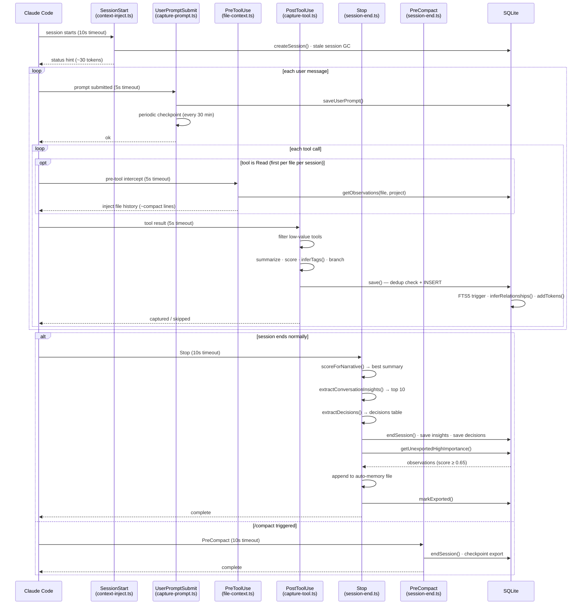
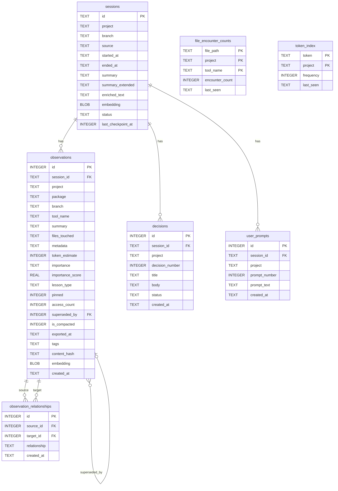
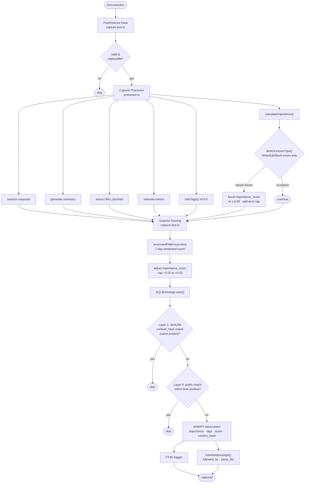
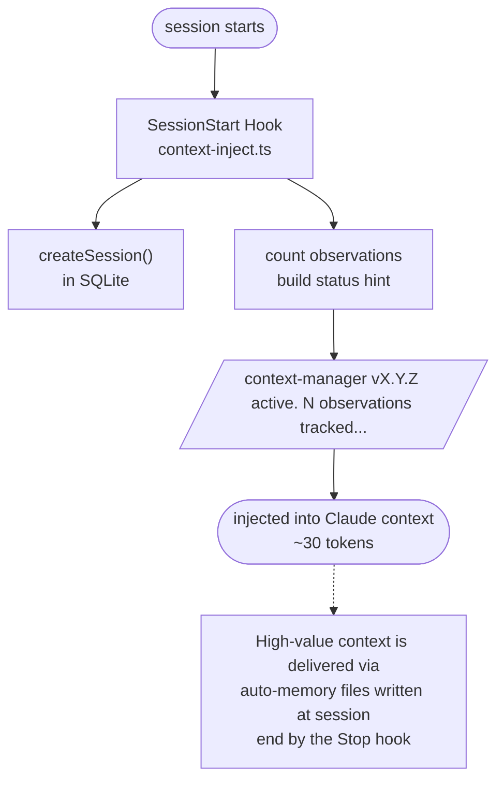
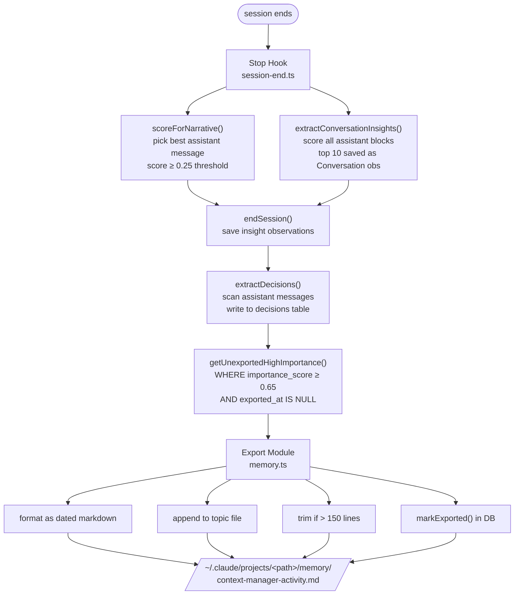
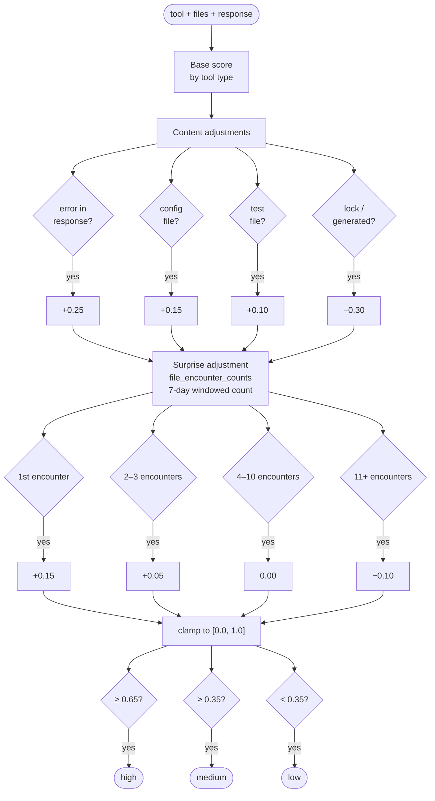
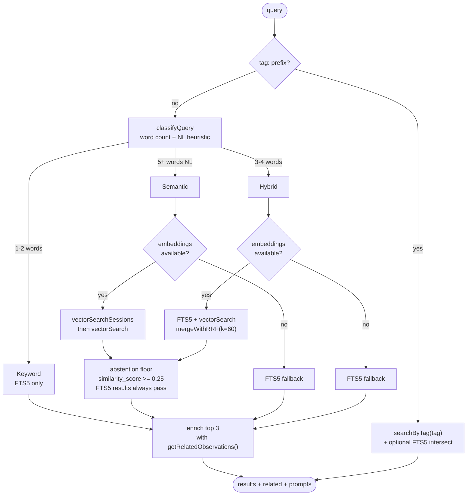

# Architecture

Detailed technical architecture for claude-context-manager.

**Status**: ACTIVE
**Last Updated**: May 29, 2026 (v0.8.125)

---

## System Overview

claude-context-manager is a Claude Code plugin with a direct-access architecture:

1. **Hook Layer** - Integrates with Claude Code's lifecycle events
2. **Storage Layer** - Direct SQLite access via better-sqlite3

No background HTTP service required - hooks access the database directly.

---

## Why SQLite?

SQLite was chosen deliberately over alternatives like HTTP-backed services (Redis, PostgreSQL) or vector databases (ChromaDB). The key constraints are that Claude Code hooks run as short-lived Node.js scripts with tight timeouts (5-10s), and users shouldn't need to install or manage external services.

| Requirement | SQLite | HTTP Service | Vector DB (ChromaDB) |
|-------------|--------|--------------|----------------------|
| No background daemon | Yes — open, read/write, close | No — needs persistent process | No — needs server + Python |
| Zero install dependencies | Yes — single file on disk | No — service management | No — ChromaDB + embeddings |
| Full-text search | FTS5 built in | Depends on backend | Native (vector similarity) |
| Synchronous access | better-sqlite3 is sync | Async HTTP calls | Async HTTP calls |
| Concurrent hook access | WAL mode handles this | Natural | Natural |
| Cold start latency | <5ms (file open) | Connection overhead | Connection + model load |

**Trade-offs accepted:**
- No AI-powered extraction (mitigated by rule-based summarization and importance classification)
- Single-machine only (acceptable — Claude Code is a local CLI tool)

**Vector search (added v0.5.5, enriched v0.6.0):** sqlite-vec extends SQLite with vector similarity search, keeping the single-file architecture. Session-level embeddings are generated from enriched text (user prompts + high-value actions + session summary) using a local ONNX model — no external APIs or services required.

**Contrast with claude-mem:** The reference project uses ChromaDB + Agent SDK HTTP service, enabling AI-powered extraction via Anthropic API calls. That's more powerful for per-observation summarization but requires Python, ChromaDB, Bun, and a running daemon. We achieve similar semantic search quality at the session level through data assembly (no AI needed) because user prompts and session summaries already contain natural language.

---

## Component Details

### 1. Hook Layer (`plugin/hooks/`)

Claude Code plugins can register hooks for lifecycle events. We use three:

#### SessionStart Hook (`context-inject.ts`)
- **Trigger**: When a new Claude Code session begins
- **Matcher**: `startup|clear|compact`
- **Purpose**: Create session record, inject minimal status hint (~30 tokens)
- **Note**: Since v0.4.0, high-value context is exported to auto-memory at session end, not injected here
- **Response Format**:
  ```json
  {
    "hookSpecificOutput": {
      "hookEventName": "SessionStart",
      "additionalContext": "context-manager v0.4.0 active. 570 observations tracked..."
    }
  }
  ```

#### UserPromptSubmit Hook (`capture-prompt.ts`)
- **Trigger**: Every time the user submits a prompt (5s timeout)
- **Purpose**: Capture user prompts for FTS5 search and session enrichment; run periodic checkpoint exports
- **Checkpoint**: Every 30 minutes (wall-clock), triggers auto-memory export so high-importance observations are available even in long-running sessions. Interval is configurable via `CONTEXT_MANAGER_CHECKPOINT_INTERVAL`.
- **Response Format**: `ok` (empty — does not inject context)

#### PreToolUse Hook (`file-context.ts`)
- **Trigger**: Before any `Read` tool call (5s timeout)
- **Matcher**: `Read`
- **Purpose**: Inject a compact history of prior work on the file being read, so Claude has file-level context before seeing the current contents
- **Scope**: Only fires on the first Read per file per session, and only when at least 2 prior observations exist for that file
- **Response Format**: Returns prior observations as `additionalContext` injected before the Read output

#### PostToolUse Hook (`capture-tool.ts`)
- **Trigger**: After every tool execution (Read, Write, Bash, etc.) — 5s timeout
- **Purpose**: Core capture pipeline: sanitize, summarize, score, tag, store
- **Response Format**:
  ```json
  {
    "status": "captured" | "skipped" | "error"
  }
  ```

#### Stop Hook (`session-end.ts`)
- **Trigger**: When Claude Code session ends normally
- **Purpose**: Extract conversation insights, save session summary, export to auto-memory
- **Session Narrative Selection** (v0.8.3): Scores all assistant messages for narrative quality and picks the best candidate rather than defaulting to the last message (which is often a closing remark):
  - Action verbs (implement, fix, add, update, refactor...) score highest
  - File path references and code blocks boost score
  - Short affirmations ("Yes", "Sure", "Let me...") score 0
  - Minimum score threshold of 0.25; falls back to last assistant message if nothing qualifies
- **Conversation Insights** (v0.6.4): Scans all assistant text blocks in the transcript for high-signal content:
  - Markdown tables (comparisons, specs, pricing)
  - Recommendation/decision language
  - Price/cost analysis
  - User fact confirmations ("you don't have...", "you confirmed...")
  - Structured content (headers, bullet lists with data)
  - Each qualifying block is scored (0.0-1.0), compressed to ~150 tokens, and saved as a `Conversation` observation
  - Top 10 blocks per session (by score) to bound token budget
- **Decisions** (v0.8.x): `extractDecisions()` scans assistant messages for architectural and technical decisions. Each decision is written to the `decisions` table with a globally sequential number (remote mode uses `GET /api/decisions/next-number` to ensure uniqueness across sessions).
- **Export**: Writes to `~/.claude/projects/<path>/memory/context-manager-activity.md`
- **Response Format**:
  ```json
  {
    "status": "complete" | "error"
  }
  ```

#### PreCompact Hook (`session-end.ts`)
- **Trigger**: When the user runs `/compact` (10s timeout)
- **Purpose**: Saves the current session state and triggers a checkpoint export before context compaction wipes the assistant's working memory. Without this hook, a `/compact` mid-session would lose the session summary and any unexported high-importance observations.
- **Response Format**:
  ```json
  {
    "status": "complete" | "error"
  }
  ```

#### Hook Lifecycle



### 2. Storage Layer (`src/storage/`)

#### Storage Interface (`src/storage/interface.ts`)

Abstraction layer for storage operations:

```typescript
export type ImportanceLevel = 'high' | 'medium' | 'low';
export type ObservationTag =
  | 'auth' | 'database' | 'testing' | 'infra' | 'config'
  | 'frontend' | 'api' | 'git' | 'build' | 'deps';

export interface Observation {
  id?: number;
  project: string;
  package?: string;  // For monorepo support
  session_id: string;
  tool_name: string;
  summary: string;
  files_touched: string[];
  metadata: Record<string, unknown>;
  token_estimate: number;
  importance: ImportanceLevel;      // Classified at capture time
  importance_score: number;         // 0.0 to 1.0
  is_compacted?: boolean;           // True if this is a compacted summary
  exported_at?: string;             // When exported to auto-memory
  tags?: string[];                  // Domain tags inferred at capture time (v0.8.6)
  content_hash?: string;            // SHA256 of summary+files_touched+stored_output, for exact dedup
  similarity_score?: number;        // Cosine similarity [0,1], only present on vector search results
  created_at: string;
}

export interface ContextStorage {
  // Core operations (hooks)
  initialize(): Promise<void>;
  save(obs: Observation): Promise<number | undefined>;  // Returns inserted ID, undefined if deduped
  getRecent(project: string, limit: number): Promise<Observation[]>;
  getWithinBudget(project: string, tokenBudget: number): Promise<Observation[]>;
  getRelevantCandidates(project: string, limit?: number): Promise<Observation[]>;
  search(query: string, project?: string): Promise<Observation[]>;
  getStats(project?: string): Promise<Stats>;

  // Session management
  createSession(sessionId: string, project: string): Promise<void>;
  endSession(sessionId: string, summary?: string): Promise<void>;
  getRecentSessions(project: string, limit: number): Promise<Session[]>;
  getSessionObservations(sessionId: string): Promise<Observation[]>;
  getSessionPrompts(sessionId: string): Promise<UserPrompt[]>;

  // User prompts (Web UI)
  saveUserPrompt(prompt: Omit<UserPrompt, 'id'>): Promise<void>;
  getRecentPrompts(project: string, limit: number): Promise<UserPrompt[]>;
  searchPrompts(query: string, project?: string): Promise<UserPrompt[]>;

  // Analytics (Web UI)
  getTimeline(project?: string, days?: number): Promise<TimelineEntry[]>;
  getProjects(): Promise<ProjectEntry[]>;
  countObservations(project?: string, tool?: string): Promise<number>;
  countSessions(project?: string, status?: string): Promise<number>;

  // Auto-memory export
  getUnexportedHighImportance(project: string, sessionId?: string, minScore?: number): Promise<Observation[]>;
  markExported(ids: number[]): Promise<void>;

  // Tag search (v0.8.6)
  searchByTag(tag: string, project?: string, limit?: number): Promise<Observation[]>;

  // Surprise scoring (v0.7.0)
  incrementFileEncounter(filePath: string, project: string, toolName: string): number;

  // Observation relationships (v0.7.0)
  getRelatedObservations(observationId: number, types?: RelationshipType[], limit?: number): Observation[];

  // Maintenance
  vacuum(olderThanDays?: number): Promise<{ observations; sessions; compacted; compacted_originals }>;
  compactObservations(olderThanDays?: number): Promise<{ compacted; originals }>;
  close(): void;
}
```

**Key methods:**
- `getUnexportedHighImportance()` - Fetches observations with score >= 0.65 not yet exported to auto-memory
- `markExported()` - Sets `exported_at` timestamp after successful export
- `getRelevantCandidates()` - Fetches up to 200 candidates (excluding low-importance) for relevance scoring
- `compactObservations()` - Groups old observations by session + tool into compressed summaries
- `vacuum()` - Also triggers compaction and returns compaction stats

#### SQLite Implementation (`src/storage/sqlite.ts`)

Direct SQLite access using better-sqlite3:
- WAL mode for concurrent access
- FTS5 for full-text search
- Prepared statements for performance
- Synchronous API (better-sqlite3 is sync)

---

## Database Schema

SQLite database at `~/.claude-context/context.db` using FTS5 for full-text search and sqlite-vec for vector similarity.

### Entity Relationships



Virtual tables (not shown above): `observations_fts` (FTS5), `user_prompts_fts` (FTS5), `decisions_fts` (FTS5), `vec_observations` (sqlite-vec), `vec_sessions` (sqlite-vec).

### DDL

```sql
-- Sessions table
CREATE TABLE sessions (
  id TEXT PRIMARY KEY,
  project TEXT NOT NULL,
  branch TEXT,                 -- Git branch at session start (v0.8.x)
  source TEXT DEFAULT 'hook',  -- 'hook' | 'manual' (manual = context_add session)
  started_at TEXT NOT NULL,
  ended_at TEXT,
  summary TEXT,
  summary_extended TEXT,       -- Longer narrative preserved for enrichment
  enriched_text TEXT,          -- Assembled text for session vector embedding
  embedding BLOB,              -- 384-dim float32 session vector (v0.6.0)
  status TEXT DEFAULT 'active',
  last_checkpoint_at INTEGER   -- Unix ms timestamp of last checkpoint export
);

CREATE INDEX idx_sessions_project ON sessions(project);
CREATE INDEX idx_sessions_started_at ON sessions(started_at);
CREATE INDEX idx_sessions_status ON sessions(status);

-- Observations table
CREATE TABLE observations (
  id INTEGER PRIMARY KEY AUTOINCREMENT,
  session_id TEXT NOT NULL,
  project TEXT NOT NULL,
  package TEXT,
  branch TEXT,                        -- Git branch at capture time (v0.8.x)
  tool_name TEXT NOT NULL,
  summary TEXT NOT NULL,
  files_touched TEXT,                 -- JSON array of absolute paths
  metadata TEXT,                      -- JSON object (tool_input, stored_output, stats)
  token_estimate INTEGER DEFAULT 0,
  importance TEXT DEFAULT 'medium',   -- 'high' | 'medium' | 'low'
  importance_score REAL DEFAULT 0.5,  -- 0.0 to 1.0
  lesson_type TEXT,                   -- Error lesson category (v0.8.x)
  skill TEXT,                         -- Skill or agent name invoked; backfilled from metadata.tool_input (v0.8.123)
  pinned INTEGER DEFAULT 0,           -- 1 = exempt from decay and compaction
  access_count INTEGER DEFAULT 0,     -- Incremented on context_get fetches
  superseded_by INTEGER REFERENCES observations(id) ON DELETE SET NULL, -- Fact supersession
  is_compacted INTEGER DEFAULT 0,     -- 1 if compacted summary
  exported_at TEXT,                   -- ISO 8601, set after auto-memory export
  tags TEXT,                          -- Comma-separated domain tags (v0.8.6)
  content_hash TEXT,                  -- SHA256 for exact dedup
  embedding BLOB,                     -- 384-dim float32 observation vector (v0.5.5)
  created_at TEXT NOT NULL,
  FOREIGN KEY (session_id) REFERENCES sessions(id)
);

CREATE INDEX idx_observations_project_created
  ON observations(project, created_at DESC);
CREATE INDEX idx_observations_session ON observations(session_id);
CREATE INDEX idx_observations_project_score
  ON observations(project, importance_score DESC, created_at DESC);
CREATE INDEX idx_observations_tags
  ON observations(tags) WHERE tags IS NOT NULL;  -- partial index (v0.8.6)
CREATE INDEX idx_observations_project_hash
  ON observations(project, content_hash) WHERE content_hash IS NOT NULL;  -- partial index for exact dedup
CREATE INDEX idx_observations_skill
  ON observations(project, skill, created_at DESC)
  WHERE skill IS NOT NULL;            -- partial index for skill stats queries (v0.8.123)

-- User prompts table
CREATE TABLE user_prompts (
  id INTEGER PRIMARY KEY AUTOINCREMENT,
  session_id TEXT NOT NULL,
  project TEXT NOT NULL,
  prompt_number INTEGER NOT NULL,
  prompt_text TEXT NOT NULL,
  created_at TEXT NOT NULL,
  FOREIGN KEY (session_id) REFERENCES sessions(id)
);

CREATE INDEX idx_user_prompts_project_created ON user_prompts(project, created_at DESC);
CREATE INDEX idx_user_prompts_session ON user_prompts(session_id);

-- FTS5 virtual tables (content tables — kept in sync via triggers)
CREATE VIRTUAL TABLE observations_fts USING fts5(
  summary, files_touched, metadata,
  content=observations, content_rowid=id
);
CREATE VIRTUAL TABLE user_prompts_fts USING fts5(
  prompt_text,
  content=user_prompts, content_rowid=id
);

-- Vector search virtual tables (sqlite-vec, conditional on extension availability)
CREATE VIRTUAL TABLE vec_observations USING vec0(
  observation_id INTEGER PRIMARY KEY,
  embedding float[384]
);
CREATE VIRTUAL TABLE vec_sessions USING vec0(
  session_id TEXT PRIMARY KEY,
  embedding float[384]
);

-- File encounter counts for surprise scoring (v0.7.0)
CREATE TABLE file_encounter_counts (
  file_path TEXT NOT NULL,
  project TEXT NOT NULL,
  tool_name TEXT NOT NULL,
  encounter_count INTEGER DEFAULT 0,
  last_seen TEXT NOT NULL,
  PRIMARY KEY (file_path, project, tool_name)
);

-- Observation relationships for linking related observations (v0.7.0)
CREATE TABLE observation_relationships (
  id INTEGER PRIMARY KEY AUTOINCREMENT,
  source_id INTEGER NOT NULL,
  target_id INTEGER NOT NULL,
  relationship TEXT NOT NULL,  -- 'same_file' | 'followed_by'
  created_at TEXT NOT NULL,
  FOREIGN KEY (source_id) REFERENCES observations(id) ON DELETE CASCADE,
  FOREIGN KEY (target_id) REFERENCES observations(id) ON DELETE CASCADE
);

CREATE INDEX idx_obs_rel_source ON observation_relationships(source_id);
CREATE INDEX idx_obs_rel_target ON observation_relationships(target_id);
CREATE UNIQUE INDEX idx_obs_rel_unique
  ON observation_relationships(source_id, target_id, relationship);

-- Decisions table (v0.8.x)
CREATE TABLE decisions (
  id INTEGER PRIMARY KEY AUTOINCREMENT,
  session_id TEXT NOT NULL,
  project TEXT NOT NULL,
  decision_number INTEGER NOT NULL,  -- Globally sequential per project (remote: server-assigned)
  title TEXT NOT NULL,
  body TEXT NOT NULL,
  status TEXT DEFAULT 'active',      -- 'active' | 'superseded' | 'reverted'
  created_at TEXT NOT NULL,
  FOREIGN KEY (session_id) REFERENCES sessions(id)
);

CREATE INDEX idx_decisions_project ON decisions(project);
CREATE VIRTUAL TABLE decisions_fts USING fts5(
  title, body,
  content=decisions, content_rowid=id
);

-- Token index for fuzzy search (v0.8.x)
CREATE TABLE token_index (
  token TEXT NOT NULL,
  project TEXT NOT NULL,
  frequency INTEGER DEFAULT 1,  -- Total occurrence count
  last_seen TEXT NOT NULL,
  PRIMARY KEY (token, project)
);

-- FTS sync triggers (INSERT / UPDATE / DELETE keep virtual tables current)
CREATE TRIGGER observations_ai AFTER INSERT ON observations BEGIN
  INSERT INTO observations_fts(rowid, summary, files_touched, metadata)
  VALUES (new.id, COALESCE(new.summary,''), COALESCE(new.files_touched,''), COALESCE(new.metadata,''));
END;
-- (Similar triggers for UPDATE and DELETE, and equivalent triggers on decisions)
```

---

## Data Flow

### Capture Flow (PostToolUse)



### Injection Flow (SessionStart)



### Export Flow (Stop Hook)



---

## Observation Processing

### Tool-Specific Summarization

Different tools produce different observation summaries:

| Tool | Summary Format | Key Data |
|------|---------------|----------|
| `Read` | "Read {filename} ({type})" | File path, file type |
| `Write` | "Write {filename}" | File path |
| `Edit` | "Edited {filename}: {meaningful description}" | Pattern-matched from diff: function/import/type additions, schema changes, net line count, or first meaningfully different line. Uses set-difference of old/new lines — never raw first-line truncation. |
| `Bash` | "Bash: {command_preview}" | Command (truncated) |
| `Grep` | "Grep: \"{pattern}\" in {path}" | Pattern, search path |
| `Glob` | "Glob: \"{pattern}\" in {path}" | Pattern, base path |
| `Task` | "Task: {description}" | Task description |

### Token Estimation

Simple heuristic: `tokens = characters / 4`

This is sufficient for budgeting purposes. More accurate estimation could use tiktoken if needed.

### Capture Filtering

Low-value tool interactions are filtered at the gate before reaching the database. Filtering is implemented in `src/utils/validation.ts` via `shouldCaptureTool()`.

**Skipped entirely:**
- Meta/orchestration tools: Task*, AgentOutputTool, Skill, EnterPlanMode, etc.
- Bash: `cd`, `pwd`, `ls`, `echo`, `clear`, `history`, `which`, `type`, `find`
- Bash (read-only): `cat`, `head`, `tail`, `wc`, `file`, `stat`, `diff`
- Bash (listing): `git stash list`, `git branch` (non-delete), `docker ps/images`, `kubectl get`
- Read: files in `node_modules/`, `.git/`, `dist/build/out/.next/`, lock files
- Glob: overly broad patterns (`*`, `*.*`)
- Edit: agent worklog/summary files

### Importance Scoring

Every captured observation is classified with an importance level and numeric score (0.0-1.0) at capture time by `calculateImportance()` in `src/capture/processor.ts`.

**Base scores by tool/pattern:**

| Tool/Pattern | Score | Rationale |
|---|---|---|
| Git commit/merge/rebase | 0.90 | Version control milestones |
| Edit/Write | 0.80 | File changes are high signal |
| npm install, pip install | 0.75 | Dependency changes |
| npm build/test, cargo build | 0.70 | Build/test results |
| Bash (general) | 0.50 | Depends on command |
| Git status/log/diff | 0.35 | Exploratory |
| Read | 0.30 | Usually exploration |
| Grep | 0.25 | Search/exploration |
| Glob | 0.20 | File listing |

**Adjustments (base):**
- Error/failure in response: +0.25
- Config files (package.json, tsconfig, Dockerfile, etc.): +0.15
- Test files: +0.10
- Lock files / generated code: -0.30

**Surprise adjustment (v0.7.0):**
After base scoring, the capture hook adjusts based on file novelty via `file_encounter_counts`:

| File encounter count | Adjustment | Rationale |
|---|---|---|
| 1 (first time) | +0.15 | Novel file, boost visibility |
| 2-3 | +0.05 | Still relatively new |
| 4-10 | 0.00 | Normal, no adjustment |
| 11+ | -0.10 | Frequently seen, reduce noise |
| **Total cap** | [-0.15, +0.20] | Prevent dominating base score |

Encounter counts are tracked per (file_path, project, tool_name) triple. The lifetime counter persists in `file_encounter_counts` for analytics, but scoring uses a **7-day windowed count** from `observations` — files untouched for a week feel novel again rather than being permanently penalized.

**Levels:** score >= 0.65 = high, >= 0.35 = medium, < 0.35 = low




### Rule-Based Compaction

Old observations (>7 days) are compressed into summaries during `vacuum()`. Implemented in `src/storage/sqlite.ts` via `compactObservations()`.

**Rules:**
- Groups observations by session + tool type
- Only compacts groups of 3+ observations
- Never compacts high-importance observations
- Compacted format: `"Read x4: file1.ts, file2.ts, file3.ts, file4.ts"` (~15 tokens vs ~80)
- Original observations are deleted after compaction

**Vacuum and prune protection (v0.8.103):** `context_vacuum` and `context_prune` now protect observations with `importance_score >= 0.65`, `pinned = 1`, or a `lesson_type` from deletion by default. Pass `include_high: true` to include them.

### Observation Relationships (v0.7.0)

Observations are automatically linked at capture time via `inferRelationships()` in `sqlite.ts`. Two relationship types are inferred:

**`followed_by`**: Links the immediately preceding observation in the same session to the new one. Provides temporal sequence for "what happened before/after this?"

**`same_file`**: When a new observation touches files, recent observations (last 24h, same project, LIMIT 5 per file) that also touch those files are linked. Enables "what else affected this file?"

**Storage**: `observation_relationships` table with `ON DELETE CASCADE` foreign keys — relationships auto-clean during compaction and vacuum.

**Retrieval**: `getRelatedObservations()` does bidirectional graph traversal (source→target and target→source). `context_search` enriches top 3 results with up to 10 related observations, deduplicated against primary results.

### Domain Tag Inference (v0.8.6)

Every observation is tagged with one or more domain categories at capture time via `inferTags()` in `src/capture/processor.ts`. Tags are stored as a comma-separated string in the `tags` column and served as `string[]` via `mapRow()`.

**Tag categories and inference rules:**

| Tag | File path patterns | Bash command patterns |
|---|---|---|
| `auth` | `/auth/`, `auth.*`, `jwt`, `token`, `oauth`, `login`, `credential` | - |
| `database` | `sqlite`, `postgres`, `mysql`, `/db/`, `schema`, `migration`, `.sql` | - |
| `testing` | `.test.`, `.spec.`, `__tests__/`, `/test/` | `npm test`, `pytest`, `cargo test`, `jest` |
| `infra` | `Dockerfile`, `docker-compose`, `.github/`, `/terraform/`, `.yml` | - |
| `config` | `package.json`, `tsconfig`, `pyproject.toml`, `Makefile`, `.env` | - |
| `frontend` | `/web/`, `/client/`, `/ui/`, `.html`, `.css`, `.tsx`, `.vue` | - |
| `api` | `/api/`, `/routes/`, `/handlers/`, `router.*`, `server.*` | - |
| `git` | - | `git commit/merge/push/pull/rebase/tag` |
| `build` | - | `npm run build`, `tsc`, `cargo build`, `make` |
| `deps` | - | `npm install`, `yarn add`, `pip install`, `cargo add` |

A single observation can have multiple tags (e.g., a test migration file gets both `database` and `testing`). Old observations have `NULL` tags — they remain searchable via FTS5/vector but won't surface in tag-filtered queries.

**Search:** `context_search` supports a `tag:X` prefix that bypasses FTS5/vector routing and calls `searchByTag()` directly. An optional keyword can follow: `tag:database sqlite` intersects tag results with FTS5 keyword results.

### Retrieval Routing (v0.7.0, updated v0.8.6)

`context_search` auto-classifies queries and routes to the optimal search strategy:



**Reciprocal Rank Fusion (RRF)**: Each result's score = Σ 1/(k + rank) across all lists where it appears. k=60 per the original paper. Results sorted by fused score, top 20 returned.

**Abstention floor**: Semantic results (observations and sessions) with `similarity_score < SEARCH_MIN_SCORE` (default `0.25`, override via `CONTEXT_SEARCH_MIN_SCORE` env var) are discarded before returning. In hybrid mode, FTS5-matched results always pass; only vector-only results are subject to the floor. Keyword (FTS5) results are never filtered — exact lexical matches are always valid. When the floor suppresses all results, the empty-result message explains why.

**Layer 2 semantic dedup**: When `context_embed` runs, `saveEmbedding()` checks cosine similarity of the new embedding against the already-embedded corpus (same project). If similarity >= 0.85, the observation is demoted to `importance='low'` and `importance_score=0.05` rather than deleted, preserving relational integrity. This runs at embed time (not capture time) to avoid loading the model in the hook process.

**Graceful degradation**: Semantic and hybrid fall back to keyword-only if sqlite-vec is not loaded or embeddings haven't been generated.

**Enrichment**: Top 3 primary results are enriched with related observations via `getRelatedObservations()`, deduplicated against the primary set.

### Temporal Query Routing

Before search routing, `classifyTemporalIntent()` in `src/utils/temporal.ts` classifies queries as `current`, `historical`, or `neutral`.

- **current**: words like "current", "latest", "now", "today", "recent" — results sorted recency-first; memory decay applied
- **historical**: words like "history", "previously", "before", "timeline", "past" — results sorted chronologically
- **neutral**: no temporal signal — uses relevance/score ordering with decay applied

Temporal classification runs before all search paths including `tag:` prefix handling.

### Fuzzy Search Pre-pass

`correctTokens()` in `src/utils/correct-tokens.ts` applies Levenshtein DP correction (edit distance <= 2) to query tokens before they reach FTS5. The `token_index` table is updated on every observation save via `addTokens()`, storing tokens >= 4 characters with frequency counts. Tokens with frequency >= 3 are considered valid corrections.

Behavior:
- Operator-prefixed tokens (`tag:X`, `decision:X`, `lesson:X`) are skipped
- The first viable match sorted by frequency is used
- When a correction is applied, the response header includes a "Corrected: X → Y" notice
- Controlled via `fuzzy` parameter on `context_search` (default: `true`)

### Progressive Disclosure

Search uses a 3-layer pattern to balance token efficiency with access to full detail:

| Layer | Tool | Returns | Use when |
|---|---|---|---|
| 1 | `context_search` | Compact one-line summaries with IDs | Scanning many results |
| 2 | `context_get` | Full observation detail (up to 20 IDs) | Examining specific results |
| 3 | `context_timeline` | Observations + session neighbors (up to 10 IDs) | Understanding context around a result |

### Branch-Aware Capture

`getCurrentBranch()` in `src/utils/git.ts` calls `git rev-parse --abbrev-ref HEAD` via `spawnSync` at capture time. The branch name is stored on both the `observations` and `sessions` tables.

In search, results from the current branch receive a soft-rank boost. The `branch` parameter on `context_search` allows explicit filtering to a specific branch.

### Fact Supersession

`FACT_CATEGORIES` in `src/utils/facts.ts` defines categories of facts that have exactly one current value (e.g., "current Node.js version", "chosen framework"). `detectFactType()` classifies new observations; `findConflictingFact()` identifies any earlier same-category observation.

When a conflict is found, the earlier observation's `superseded_by` is set to the new observation's ID. Superseded observations are excluded from search by default; pass `include_superseded: true` to opt in. Relational integrity is preserved — observations are updated, not deleted.

### Memory Decay

`applyDecay()` adjusts the effective importance score for search ranking in the neutral temporal path:

```
effective_score = (base_importance * 0.60) + (recency * 0.25) + (log_frequency * 0.15)
```

- **Recency**: 23-day half-life (`Math.pow(0.5, ageDays / 23)`)
- **Frequency**: `Math.log(access_count + 1)` normalized
- **Exempt**: observations with `pinned=1`, `lesson_type IS NOT NULL`, or stored in the `decisions` table

Decay is applied only during search scoring, not stored back to the DB. The stored `importance_score` reflects capture-time value.

### Tiered Recall Budget

`getWithinBudget()` and `getSessionObservations()` both filter `AND is_compacted = 0 AND superseded_by IS NULL` at the SQL level so compacted summaries and superseded facts never count against the budget or appear in session views.

`getWithinBudget()` applies `applyDecay()` before ranking (consistent with `search()`), then allocates in two passes:

1. **High-importance pass** (60% of effective budget): observations with `importance_score >= 0.65`, sorted by decayed score descending.
2. **Remainder pass** (40% of effective budget): all other observations, sorted by decayed score descending.

Both passes use `continue` on overflow rather than `break`, so a smaller observation later in the sort order is included even when a larger predecessor was skipped.

`context_list` reads `CONTEXT_MANAGER_TOKEN_BUDGET` and applies a `TOKEN_BUDGET * 0.8` session-boundary stop: once adding the next session would exceed the limit, it stops. At least one session is always shown even if it alone exceeds the limit. When truncated, a footer is appended:

```
[Budget: showing N of M sessions. Use context_search for full history.]
```

`budget_fill_tokens` in the `Stats` interface (renamed from `typical_injection_tokens`) is computed by actually calling `getWithinBudget()` for the configured budget and summing the returned token estimates, so the value in `context_stats` and the web UI reflects real allocation capacity rather than a heuristic average of session sizes.

### Decisions Entity

The Stop hook calls `extractDecisions()` to scan assistant messages for architectural and technical decisions. Each qualifying decision is stored in the `decisions` table with:
- A globally sequential `decision_number` per project (in remote mode, the server assigns the number via `GET /api/decisions/next-number` to prevent gaps across concurrent sessions)
- FTS5 indexing via `decisions_fts`

`context_decisions` queries the decisions table with optional free-text search. The `decision:` prefix in `context_search` also routes to decisions.

### Error Lessons

`detectLessonType()` in `src/capture/processor.ts` classifies error-related observations (restricted to Write, Edit, NotebookEdit, MultiEdit, and Bash with non-zero exit codes) into lesson categories. The `lesson_type` is stored on the observation.

`context_lessons` returns observations where `lesson_type IS NOT NULL`, filterable by `lesson_type`, `query`, and `days`. The `lesson:` prefix in `context_search` also routes to lessons. Lesson observations are exempt from memory decay.

### Skill Lessons

The skill lessons system provides a two-tier design for accumulating and retrieving per-skill experience across sessions.

**DB evidence layer (`skill` column):** A nullable `skill TEXT` column on `observations` records which skill or agent was invoked for each Skill, Agent, and Task tool row. At migration time, existing rows are backfilled from `metadata.tool_input.skill` (Skill rows) and `metadata.tool_input.subagent_type` (Agent/Task rows). New rows are populated at capture time. A partial index on `(project, skill, created_at DESC) WHERE skill IS NOT NULL` keeps skill stats queries fast.

`context_skill_stats` queries this column in two modes:
- **Aggregate** (no `skill` param): returns all distinct skill names sorted by `invocation_count DESC` plus a `total` distinct-skill count. Supports `project`, `days`, and `limit` filters.
- **Detail** (`skill` param): returns stats for a single skill plus attributed lesson observations (`lesson_type IS NOT NULL AND skill = ?`).

**Sidecar layer (`.lessons.md` files):** Lessons written by doc-writer live in `~/.dotfiles/.claude/skills/<skill-name>/.lessons.md`. These are human-editable Markdown files outside the database.

`context_skill_lessons` reads the sidecar for a named skill directly from the filesystem. The skill name is validated against `/^[a-z0-9][a-z0-9-]*$/` before path construction to prevent traversal. If the sidecar does not exist, the tool returns `"No lessons accumulated for '<name>' yet."`.

The two tiers are complementary: the DB layer surfaces invocation frequency and error patterns (objective, automatically populated); the sidecar layer surfaces human-curated experience (subjective, doc-writer maintained).

### Reflection

`context_reflect` calls `buildReflection()` and `formatReflection()` in `src/utils/reflect.ts`. The reflection:
- Groups recent high-importance observations and lessons by their first domain tag
- Only produces output for groups of 3+ observations (noise gate)
- Lesson groups are prefixed with "Avoid:" to highlight patterns to watch out for
- The Stop hook appends a reminder to call `context_reflect` when a session is >= 7 days old or has >= 10 high-importance observations

---

## Privacy Implementation

### Tag Stripping (ReDoS-Safe)

Before storing any content, strip `<private>` tags using a safe, iterative approach:

```typescript
function stripPrivateTags(content: string): string {
  // ReDoS-safe implementation: process character by character
  let result = '';
  let i = 0;
  const openTag = '<private>';
  const closeTag = '</private>';

  while (i < content.length) {
    const remainingLength = content.length - i;

    if (remainingLength >= openTag.length &&
        content.substring(i, i + openTag.length).toLowerCase() === openTag) {
      const closeIndex = content.toLowerCase().indexOf(closeTag, i + openTag.length);

      if (closeIndex !== -1) {
        result += '[REDACTED]';
        i = closeIndex + closeTag.length;
        continue;
      }
    }

    result += content[i];
    i++;
  }

  return result;
}
```

### What Gets Stored

| Stored | Not Stored |
|--------|------------|
| File paths | Full file contents |
| Tool names | Full tool outputs |
| Brief summaries | Content in `<private>` tags |
| Timestamps | Detected secrets |
| Session IDs | - |

---

## Configuration

### Environment Variables

All variables are read from `~/.claude-context/.env` at hook and MCP server startup. No shell exports or `.zshrc` configuration needed.

| Variable | Default | Description |
|----------|---------|-------------|
| `CONTEXT_MANAGER_DB` | `~/.claude-context/context.db` | Database path |
| `CONTEXT_MANAGER_TOKEN_BUDGET` | `4000` | Max tokens per MCP recall tool response (context_list, context_search) |
| `CONTEXT_MANAGER_PORT` | `3847` | Web dashboard port |
| `CONTEXT_MANAGER_HOST` | `localhost` | Web dashboard bind address |
| `CONTEXT_SEARCH_MIN_SCORE` | `0.25` | Minimum cosine similarity for semantic/hybrid results; FTS5 results are never filtered |
| `CONTEXT_MANAGER_URL` | _(unset)_ | When set, hooks POST to this URL instead of writing to local SQLite (proxy/remote mode) |
| `CONTEXT_MANAGER_TOKEN` | _(unset)_ | Bearer token; required when `CONTEXT_MANAGER_URL` is set |
| `CONTEXT_MANAGER_CHECKPOINT_INTERVAL` | `30` | Minutes between periodic checkpoint exports during a live session |
| `CONTEXT_MANAGER_EMBED_INTERVAL` | `10` | Minutes between background embedding passes in HTTP server mode |

---

## Security Considerations

### Input Validation
- Validate all hook inputs against expected schema
- Validate project paths against allowed root directories
- Reject paths outside approved project roots

### Path Normalization
- Use `fs.realpathSync()` to resolve symlinks
- Prevent directory traversal attacks
- Validate normalized paths

### Database Security
- Enable `PRAGMA foreign_keys = ON`
- Use parameterized queries via prepared statements
- Handle NULL values in FTS triggers with COALESCE

---

## Error Handling

### Hook Failures

Hooks fail gracefully:
- Log errors to stderr
- Return empty/neutral response
- Never block Claude Code operation
- Exit with code 0 to prevent hook failures from blocking Claude

### Database Errors

- WAL mode for concurrent access
- Database auto-creates on first use
- Degrade gracefully if database is unavailable

---

## Performance Considerations

### Hook Latency

- SessionStart: Target <500ms for context injection
- PostToolUse: Target <100ms, non-blocking
- Stop: Can take longer, session is ending

### Database Queries

- Index on `project` + `created_at` for recency queries
- Index on `project` + `importance_score` + `created_at` for relevance queries
- FTS5 for keyword search (sub-100ms typical)
- Pre-filter `importance != 'low'` at SQL level to reduce candidate pool
- LIMIT 200 candidates for in-memory relevance scoring
- Token budget limits final selected results

### Memory Usage

- SQLite with WAL uses minimal memory
- No in-memory caching (rely on OS page cache)
- better-sqlite3 is efficient with large results

---

## Installation

The install script (`scripts/install.js`):

1. Copies `dist/` to `~/.claude/plugins/context-manager/`
2. Creates symlink to `node_modules` (for better-sqlite3)
3. Adds hooks to `~/.claude/settings.json` (idempotently)
4. Creates `~/.claude-context/` directory

The uninstall script (`scripts/uninstall.js`):

1. Removes hooks from `~/.claude/settings.json`
2. Removes `~/.claude/plugins/context-manager/`
3. Optionally removes `~/.claude-context/` (with `--remove-data` flag)

---

## Web UI Dashboard

Local web interface for browsing context observations and analytics. Implemented in v0.3.0, extended through v0.8.x.

See [ADR-001: Web UI Dashboard](ADR-001-web-ui-dashboard.md) for the full design rationale and technology decisions.

### Features
- **Sessions View**: Browse all Claude Code sessions with summaries and observation counts
- **Search**: Full-text search across observations and prompts
- **Analytics**: Token usage timeline, activity charts, tool distribution
- **Project Stats**: Per-project observation counts and activity
- **Import**: Upload a `context.db` file from another machine to merge history (Docker/native server modes only)

### Architecture
- **Server**: Fastify (port 3847)
- **Storage**: Direct SQLite access via shared storage layer
- **Client**: Single-page HTML with vanilla JavaScript
- **Auth**: Bearer token required in remote/network mode; `window.__CTX_TOKEN` injected into `index.html` at serve time (`Cache-Control: no-store`); `GET /` is excluded from auth

### Usage
```bash
npm run web       # Production mode
npm run web:dev   # Development with live reload
```

See `web/server/index.ts` for server implementation and `web/client/index.html` for UI.

---

**Last Updated**: May 27, 2026 (v0.8.103)
